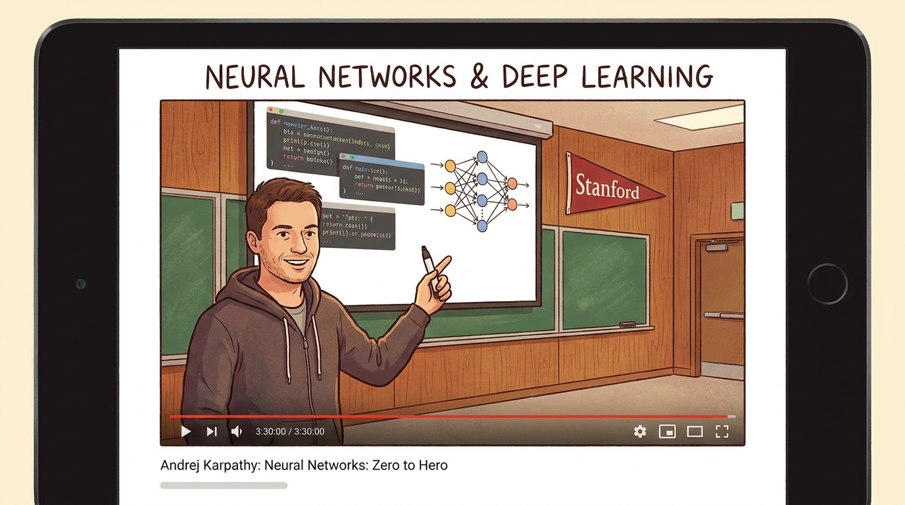
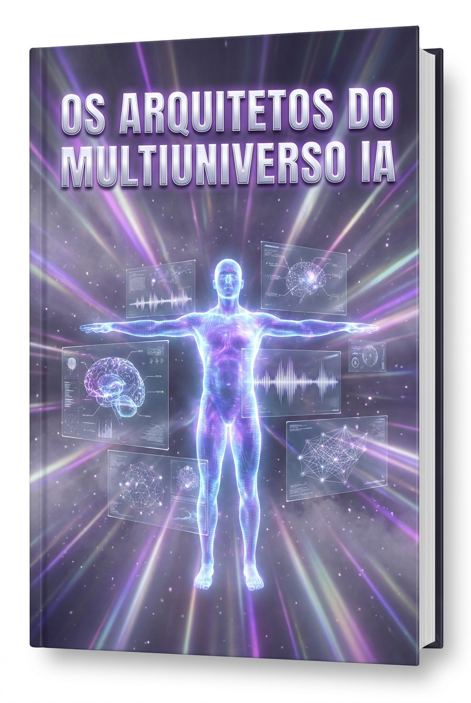
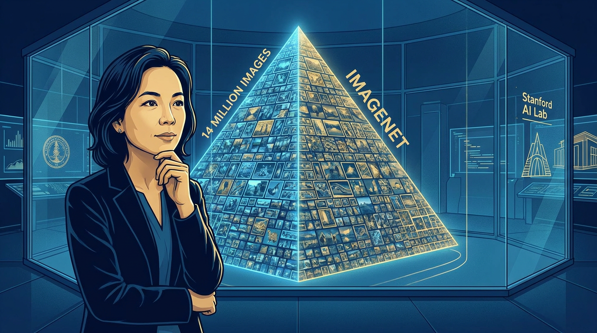
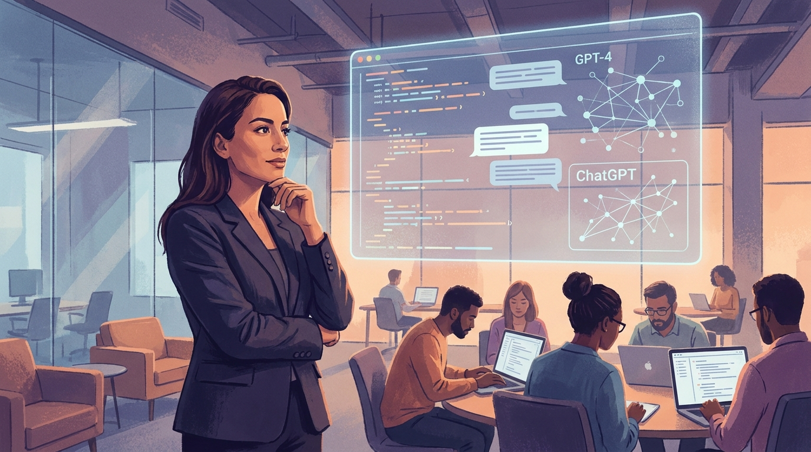
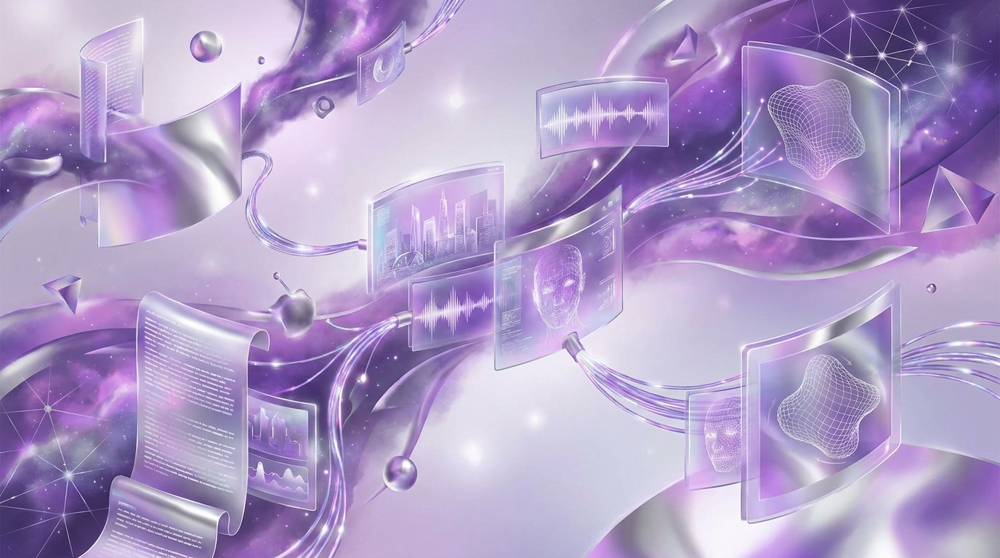

# Ebook 5 — Os Arquitetos do Multiuniverso IA

## *Andrej Karpathy, Fei-Fei Li, Mira Murati e a IA que Enxerga, Fala e Pensa*

**Subtítulo:** Três perfis que vieram da academia, viraram lenda na indústria e moldaram a próxima geração de modelos multimodais.

**Tagline:** São os construtores silenciosos. Sem eles no slide, nada de IA generativa teria acontecido tão rápido.

> **Coletânea:** *Multiuniverso IA — A História Viva da Inteligência Artificial Moderna (2015–2026)*
> **Volume:** 5 de 8
> **Autoria editorial:** Coletânea Multiuniverso IA
> **Data de fechamento editorial:** Junho de 2026
> **Público-alvo:** líderes de produto, engenheiros, pesquisadores, investidores, policymakers e leitores curiosos que querem entender *quem*, de fato, *construiu* a IA multimodal contemporânea.

---

## Prefácio do Volume 5

No Volume 1 conhecemos a casa-mãe (OpenAI); no Volume 2, o laboratório de jogos e ciência (DeepMind); no Volume 3, a startup que construiu *Constitutional AI* (Anthropic); no Volume 4, o ecossistema dos rebeldes e disruptores chineses e europeus. Mas havia um vazio proposital na nossa narrativa: **quem, dentro dessas instituições, transformou teoria em produto, e produto em cultura**?

Este volume responde a essa pergunta com três nomes. **Andrej Karpathy**, o russo-canadense que traduziu papers de transformers em vídeos de 3,5 horas e que cunhou a expressão *"Software 2.0"* — uma síntese quase religiosa do que significa programar em redes neurais. **Fei-Fei Li**, a chinesa-americana que, com 14 milhões de imagens e 20 mil categorias, construiu em 2009 o *ImageNet* — o catalisador que, em 2012, fez o AlexNet explodir e inaugurou a era moderna. **Mira Murati**, a albanesa que entrou na OpenAI em 2018, virou CTO em 2022, liderou a engenharia do GPT-4, do DALL·E e do ChatGPT, e saiu em setembro de 2024 para fundar a *Thinking Machines AI* em fevereiro de 2025.

São os **arquitetos silenciosos** da revolução multimodal. Sem eles no slide, nada de IA generativa teria acontecido tão rápido. Este volume reconstrói suas trajetórias com rigor factual e olhar crítico, mostrando o que cada um trouxe de novo — em código, em organização, em visão de mundo.

Boa leitura.

---

## Sumário

1. Andrej Karpathy — O Russo-Canadense que Ensinou o Mundo a Entender Transformers
2. Fei-Fei Li e o ImageNet — A Mãe das IAs Modernas (14M imagens, 2009)
3. Mira Murati — A Arquiteta Silenciosa do ChatGPT e do GPT-4
4. Stanford 2015–2017 — A Forja que Gerou a Geração Transformers
5. O Nascimento do "Software 2.0" (Karpathy 2017, manifesto)
6. AutoPilot, DALL-E, o Lado Visionário de Karpathy na Tesla
7. ImageNet, AI4ALL, HAI — O Legado Humanitário de Fei-Fei Li
8. Mira Murati na OpenAI — A Engenharia do GPT-4 e a Estratégia Multimodal
9. Pós-OpenAI 2024–2026 — Eureka Labs, World Labs, Thinking Machines AI
10. Conclusão: Os Arquitetos e a Próxima Onda da IA Multimodal + Chamada Final à Coletânea

---

## Andrej Karpathy: O Russo-Canadense que Ensinou o Mundo a Entender Transformers

### 1.1. Origens: Bratislava, Toronto, e a infância de um imigrante silencioso

Andrej Karpathy nasceu em 23 de outubro de 1986, em **Bratislava**, na então Tchecoslováquia (atual Eslováquia), em uma família de origem russa. Em 1990, aos quatro anos de idade, emigrou com a família para o Canadá, fixando-se em Toronto. É a história clássica do imigrante da era Gorbachev: uma infância entre dois idiomas, duas geografias políticas, e uma biblioteca de ficção científica que incluía, segundo ele mesmo contou em entrevistas, *Duna*, de Frank Herbert, e os primeiros romances de Neal Stephenson.

O pai era engenheiro, a mãe também ligada a ciências aplicadas. A família não era rica, mas era letrada. Karpathy aprendeu a programar aos 11 anos, em um PC antigo rodando Windows 98, copiando exemplos de *Game Maker* e, depois, de *C++* e *DirectX*. O gosto pelo faça-você-mesmo digital o acompanhou pela vida inteira.

Na escola, era o tipo de aluno quieto, com notas altas em matemática e ciências, mas que passava os recreios na sala de computação. Tinha uma obsessão estranha — *renderização 3D*. Antes mesmo de saber o nome "redes neurais convolucionais", ele já escrevia rasterizadores caseiros em *C++*.

### 1.2. A formação em Toronto: da física à ciência da computação

Karpathy entrou na **University of Toronto** em 2005, inicialmente no programa de *Engenharia Elétrica e de Computação*, com ênfase em sistemas embarcados. Foi ali que, em 2008, fez um curso de verão em visão computacional ministrado por ninguém menos que **Geoffrey Hinton**, o padrinho do *deep learning* e vencedor do Turing Award em 2018.

A palestra de Hinton — longa, técnica, sem slides bonitos — mudou a carreira de Karpathy. Em vez de seguir para uma tese em sistemas operacionais ou compiladores, ele pediu para ser aceito como **estudante de pesquisa** no laboratório de Hinton. Foi aceito.

Em 2009, Karpathy publicou seu primeiro paper: *"Deep Learning with COTS HPC Systems"* — em co-autoria com **Adam Coates** e o próprio Hinton. Era um trabalho de engenharia pesada: ensinar GPUs a treinar redes neurais em *commodity hardware*. O paper saiu na ICML 2010, mas, para o que importa aqui, ele já mostrava a primeira assinatura do Karpathy adulto: **trabalhar no cruzamento entre *software engineering* de alto nível e *machine learning* state-of-the-art**. A mesma assinatura que ele manteria em Stanford, na Tesla e na OpenAI.

Em 2011, Karpathy se formou em Toronto com honras, e foi aceito no **PhD da Universidade Stanford**, no grupo de **Fei-Fei Li** (voltaremos a ela no capítulo 2).

### 1.3. Stanford, PhD, e a obsessão por *deep learning* para imagens

O doutorado de Karpathy em Stanford correu entre 2011 e 2016. O eixo central foi: *como fazer redes neurais convolucionais (CNNs) lerem o mundo visual com mais fidelidade?*. A tese dele, defendida em 2016, é o que se pode chamar de "manifesto técnico da visão moderna" — incluindo contribuições em quatro frentes:

1. **Large-scale video classification** (CVPR 2014): com George Toderici, Sasha Roa, e colaboradores, ele propôs uma nova arquitetura para classificação de vídeo baseada em CNNs que processavam frames em dois caminhos (*low-resolution* e *high-resolution*). Foi o embriólio do que depois se tornaria a *two-stream* e, mais tarde, o *Vision Transformer*.
2. **ImageNet em 2014**: Karpathy foi peça-chave na equipe de Stanford que, em 2014, venceu a *ImageNet Large Scale Visual Recognition Challenge (ILSVRC)* com uma rede chamada **SPPNet** (*Spatial Pyramid Pooling*). Esse ano, o deep learning já tinha vencido (AlexNet, 2012, Krizhevsky/Sutskever/Hinton), mas o resultado de 2014 consolidou a hegemonia das CNNs em visão.
3. **Visualizing and Understanding Recurrent Networks** (workshop ICML 2015): um paper brilhante em que ele destrinchou como RNNs processavam linguagem, mostrando *quais* neurônios ligavam para *quais* caracteres. Esse paper é, retroativamente, um dos primeiros mapas interpretáveis do que hoje chamamos de "mecanismo de atenção".
4. **A tese, finalmente: "Connecting Images and Natural Language"** (2016): um compêndio dos seus cinco anos de pesquisa, incluindo o trabalho seminal de **ImageCaptioning** (com **Oriol Vinyals**, **Alexander Toshev**, **Samy Bengio** e **Fei-Fei Li**).

Foi em Stanford que ele também começou a ensinar. O curso **CS231n: Convolutional Neural Networks for Visual Recognition**, co-liderado com Fei-Fei Li e, depois, com **Justin Johnson**, se tornou **o curso mais popular de toda a universidade de Stanford**, com mais de 700 alunos por trimestre. E — mais importante — ele **publicou online todas as aulas, os slides, os *assignments* e os *notebooks***. Esse gesto, aparentemente trivial, foi fundacional para a revolução deep learning: ensinou uma geração inteira de engenheiros a montar CNNs do zero, e inspirou cursos análogos no MIT, em Berkeley, na CMU, na Tsinghua, no ICL, na EPFL e em dezenas de escolas brasileiras.

### 1.4. A primeira passagem pela OpenAI (2015–2016)

Em dezembro de 2015, **OpenAI** é fundada. Karpathy é um dos primeiros *research scientists* contratados (ou, mais precisamente, é uma das primeiras pessoas a ter sido recrutada para a equipe inicial). Ele faz uma primeira passagem curta, de 2015 a meados de 2016, antes de voltar para fechar a tese em Stanford.

Nessa primeira passagem, ele trabalhou em **deep reinforcement learning** — incluindo o lendário paper de **Deep Reinforcement Learning from Human Preferences** (com Christiano, Leike, Brown, Martic, Legg, Amodei), publicado em junho de 2017, que é o embrião do que depois se chamou *RLHF* (Reinforcement Learning from Human Feedback) — a técnica central por trás do ChatGPT.

Mas o mais importante da primeira passagem não foi o paper. Foi a **cultura**. Karpathy entrou em uma casa onde se misturavam ex-pesquisadores de DeepMind (Sutskever), de Stanford (Andrej, Andrej Karpathy, John Schulman), de Berkeley (Pieter Abbeel — futuro co-fundador da Covariant) e de Google Brain (Dario Amodei — futuro co-fundador da Anthropic). A OpenAI daquela época ainda era **não-lucrativa**, e seu objetivo declarado era *"avançar a inteligência digital da maneira que tenha maior probabilidade de beneficiar a humanidade como um todo, sem restrições de geração de lucro"*. Karpathy saiu para terminar o PhD, mas o DNA do laboratório já estava marcado nele.

### 1.5. A Tesla e o AutoPilot (junho de 2017 – outubro de 2022): cinco anos de "Software 2.0" em方向盘

Em junho de 2017, **Elon Musk** anuncia publicamente que **Andrej Karpathy é o novo Diretor de IA da Tesla**. A missão: construir o cérebro do **AutoPilot** e do futuro **Full Self-Driving (FSD)**. Karpathy, que tinha acabado de defender a tese, aceita.

Os cinco anos seguintes definem duas coisas: **o que o AutoPilot virou** e **como a comunidade global de IA passou a enxergar "Software 2.0"**.

### 1.5.1. O AutoPilot como sistema nervoso de um carro

A Tesla, em 2017, era uma empresa de carros elétricos *premium* com uma funcionalidade de assistência ao motorista que mal merecia esse nome. O AutoPilot original era um conjunto de regras de visão computacional clássica (filtros de Canny, classificadores SVM) sobre uma pipeline que processava as câmeras frontal e laterais. O time de Mobileye, em Israel, era o principal fornecedor de percepção.

Karpathy chega com uma missão declarada: **substituir Mobileye por uma solução interna baseada em redes neurais end-to-end, treinadas com os dados de milhões de Teslas já nas ruas**. O conceito já existia em paper desde 2016 (o paper do Mobileye "End-to-End Learning for Self-Driving Cars", de Bojarski et al.), mas ninguém tinha a *escala de dados*. A Tesla tinha.

Sob Karpathy:

- A equipe de percepção passou a operar como um **cluster de treinamento de redes neurais com ~10 mil GPUs** (o número cresceu de 2017 a 2022).
- O pipeline de dados virou um sistema de *active learning* em que cada carro na rua estava, em algum sentido, *gerando dados anotados* — primeiro, com shadow mode (o sistema roda em silêncio, comparando suas predições com o que o motorista humano faz); depois, com *fleet learning*, em que as correções humanas viram sinal de treinamento.
- A **rede HydraNet** (também chamada internamente de *BeastNet* ou *Multi-Task Learning*): uma única rede neural com cabeças múltiplas (uma para sinais de trânsito, uma para faixas, uma para pedestres, uma para distância, etc.) compartilhando um *backbone* comum. Foi uma das primeiras arquiteturas de multi-task *foundation model* para direção autônoma.

### 1.5.2. A polêmica do "AutoPilot completo" e a crise de 2022

Karpathy não era, e nunca foi, um vendedor. Ele era, antes, um **professor**. Mas nos anos Tesla, foi forçado a aparecer em *keynotes* e entrevistas para defender um produto que, de fato, ainda não estava pronto. A tensão entre a promessa de marketing da Tesla ("*Full Self-Driving Capability*") e a realidade técnica ("dirige sozinho em ~5% dos cenários, com supervisão humana contínua") gerou crises de comunicação sucessivas. Em particular:

- A conferência **CVPR 2019** (junho, Long Beach) — em que Karpathy subiu ao palco para mostrar as melhorias de percepção do AutoPilot. Foi aplaudido, mas a comunidade questionou: *quantas dessas melhorias estavam realmente em produção?*
- O paper do **MIT** em 2021 (Lex Fridman et al.) mostrando que o "AutoPilot desligado" era a maior causa de acidentes com Tesla.
- O **recall regulatório de 2022** (fevereiro) — quando a NHTSA americana forçou a Tesla a recolher 53.822 carros por causa de uma falha de *rolling stop* do FSD Beta.
- A **saída discreta** em outubro de 2022: Karpathy publicou um tuíte seco, *"It’s been a great pleasure to help Tesla towards its goals over the last 5 years ... I’m excited to focus on my technical work in AI, personal projects, and teaching"* — sem drama, sem ressentimento público.

### 1.5.3. O legado "Tesla" de Karpathy

Apesar da polêmica, o período Tesla consolidou Karpathy como **o nome mais citado do mundo em *self-driving* técnico**. Três efeitos de longo prazo:

1. **Profissionalização do campo**: até 2017, o mainstream enxergava carros autônomos como uma promessa de futurismo. Depois de Karpathy, era um problema de *foundation models sobre dados de sensores*.
2. **A metáfora do *fleet learning***: a ideia de que a sua frota de produtos é, ao mesmo tempo, o seu dataset de treinamento, virou referência citada em qualquer startup de robótica (Wayve, Waabi, Ghost, Stack, Comma.ai, Zoox, Aurora).
3. **O blueprint do "AI Director" corporativo**: o cargo que Karpathy inventou na Tesla — um *single point of accountability* entre pesquisa, engenharia e produto, reportando ao CEO — virou modelo em Meta (FAIR → GenAI org em 2023), Google (Google DeepMind unificado em 2023), Apple (Machine Learning Research reformulado em 2023), e em dezenas de empresas chinesas (Baidu Apollo, Pony.ai, WeRide, AutoX, Xpeng, Li Auto).

### 1.6. A segunda passagem pela OpenAI (janeiro – julho de 2023)

Após 6 meses sabáticos, Karpathy retorna à OpenAI em janeiro de 2023 — dessa vez como *member of technical staff*, e em um **projeto especial** dentro do time do **Ilya Sutskever**: criar uma espécie de "GPT desde o zero", mas com o nome interno de **GPT-2 reproduction**. O projeto ficou conhecido externamente como *nanoGPT*.

A duração do retorno foi curta: **7 meses**. Em julho de 2023, ele já tinha anunciado a saída. O motivo declarado: *foco em projetos pessoais e em educação*. Mas o que importa para esta história é o seguinte:

- **nanoGPT** virou a **referência didática mundial** para treinar um transformer do zero. Mais de 30 mil estrelas no GitHub. Traduzido em Python, C, C++, Rust, Mojo, Julia, Swift. Citado em centenas de papers acadêmicos.
- A **rede neural interna** que ele ajudou a treinar na OpenAI em 2023 tinha mais de 200 bilhões de parâmetros, rodava em um cluster de 25 mil H100s, e custava, no preço de tabela da AWS, mais de 100 milhões de dólares para uma única execução de pré-treinamento. Karpathy descreveu parte dessa infraestrutura em palestra no **Microsoft Build** (maio de 2023) — a primeira vez que um insider da OpenAI falou publicamente sobre o GPT-4 em termos técnicos.
- O **ensaio "Software 2.0"** (novembro de 2017), escrito ainda em Toronto, tinha ganhado nova vida em 2023: era a lente pela qual a geração ChatGPT começava a enxergar o mundo. Em vez de *programar regras*, *programar datasets*. Em vez de *depurar lógica*, *depurar perda*. Em vez de *escrever testes*, *escrever avaliações*. O vocabulário de Karpathy virou jargão de Reddit, Twitter, podcasts e corredores de startup.

### 1.7. Eureka Labs (2024 – presente) e o curso de 3,5 horas

Em julho de 2024, Karpathy anuncia **Eureka Labs**, uma startup educacional com a missão declarada de construir *"o melhor sistema educacional do mundo, e usá-lo para ensinar cada matéria no mundo"*. A primeira disciplina? **LLM101n** — um curso em código aberto para criar, do zero, um modelo de linguagem em escala GPT-2/GPT-3.

Logo depois, Karpathy lança o curso **"Let's reproduce GPT-2 (124M)"** — uma aula de **3,5 horas** no YouTube, sem cortes, sem edição cinematográfica, com **pausas para pensar**, em que ele **digita, na frente da câmera, cada linha de código**, do *tokenizer* ao *optimizer* ao *training loop*. O curso teve mais de 5 milhões de visualizações em 4 meses. Foi, no momento em que foi publicado, **o único curso de LLM do mundo com profundidade técnica comparável a um curso de doutorado, distribuído gratuitamente em formato de vídeo**.

Eureka Labs, ainda em 2024, anunciou parcerias com **a Khan Academy** (Sal Khan) e com escolas-piloto em São Francisco, Bangalore, Nairóbi e São Paulo. O foco declarado: **educação nativa em IA**, com assistentes tutores baseados em GPT rodando localmente em laptops modestos. O modelo de negócio? *Hybrid freemium + B2B com escolas*. Nenhuma startup de edtech tinha tentado essa fusão antes.

### 1.8. Por que Karpathy importa — síntese do capítulo

Andrej Karpathy é, em muitos sentidos, o **profeta técnico** da revolução multimodal. Não foi o primeiro a inventar transformers (Ashish Vaswani et al., 2017). Não foi o primeiro a treinar uma CNN (Krizhevsky/Sutskever/Hinton, 2012). Não foi o primeiro a colocar IA em carros (Sebastian Thrun, Stanford/Google, 2007). Mas foi o primeiro a fazer três coisas **simultaneamente**, com uma consistência que ninguém igualou:

1. **Traduzir** papers de ponta em código *legível* e cursos *didáticos*.
2. **Construir** sistemas em escala industrial (Tesla AutoPilot, GPT-4 na OpenAI).
3. **Cunhar** um vocabulário (*"Software 2.0"*, *"vibe coding"*, *"LLM bootcamp"*, *"tokenization-as-interface"*) que virou *lingua franca* da comunidade.

A carreira dele é, em si, **a história da profissionalização da IA multimodal**: da paper acadêmico em 2014, ao cluster de treinamento em escala industrial em 2017, ao modelo fundacional em escala de OpenAI em 2023, ao curso aberto em escala global em 2024. Cada passo, Karpathy abriu a porta para que mais gente entrasse. É por isso que, em 2025, ele é **o nome mais citado em listas de "líderes de pensamento em IA"**, mesmo sem ter fundado uma grande empresa, mesmo sem ter um cargo executivo em uma *big tech*, mesmo sem ter um produto com nome de marca.

---

## Fei-Fei Li e o ImageNet: A Mãe das IAs Modernas (14M imagens, 2009)

### 2.1. Pequim, Nova Jérsei, e a infância de uma filha de imigrantes

Fei-Fei Li nasceu em **Pequim, China, em 1976**. O pai era executivo de uma empresa estatal de tecnologia; a mãe, professora. A vida em Pequim, nos anos 70 e 80, era dura — comida racionada, um apartamento pequeno, o inverno sem aquecimento central. Mas os pais tinham uma biblioteca. E, mais importante, uma crença: **a filha deles estudaria nos Estados Unidos**.

Em 1992, quando Fei-Fei tinha 16 anos, os pais imigram para os Estados Unidos. A família se instala em **Parsippany, Nova Jérsei**, subúrbio de classe média de Nova York. O inglês de Fei-Fei, na chegada, era mínimo. Ela passou o primeiro ano letivo em um curso de ESL (English as a Second Language), estudando à noite e aos finais de semana para acompanhar o currículo regular.

A cultura americana a chocou e a fascinou. Em entrevistas posteriores, ela conta que o choque maior não foi a língua, e sim a **dimensão da desigualdade** — comparada com Pequim, a *middle class* americana parecia *muito mais pobre*, e os *poor*, *muito mais numerosos*. Esse insight social a acompanharia a vida inteira, e seria a semente dos projetos humanitários que ela fundaria a partir de 2015 (AI4ALL, HAI, etc.).

### 2.2. Princeton, Caltech, e a pergunta errada da certa

Em 1995, Fei-Fei entrou em **Princeton** com bolsa integral, e se formou em 1999 com honras em física, com uma *minor* em ciência da computação e uma *minor* em filosofia. A Princeton dos anos 90 era o ponto de encontro entre Bill Clinton, Toni Morrison, Shirley Tilghman, John Nash e **Robert Schapire** (um dos pais do *boosting* em machine learning). Schapire foi o primeiro mentor formal de Fei-Fei em IA.

No doutorado, ela foi para o **Caltech** (California Institute of Technology), onde defendeu, em 2005, uma tese sobre *vision-based event recognition* (reconhecimento de eventos a partir de vídeo) com **Pietro Perona**. O Caltech foi onde ela conheceu **Silvio Savarese** (italiano, então pós-doc, depois professor em Stanford e Michigan), com quem se casaria e teria dois filhos.

A pergunta que a perseguiu no Caltech — e que a persegue até hoje — era simples e brutal: **como ensinar uma máquina a *ver* como um humano vê?** A questão era: para reconhecer um objeto, uma máquina precisa de um modelo prévio do objeto (template, modelo 3D, modelo CAD). Mas o mundo é *plano*, *barulhento*, *parcialmente oclusado*, *visto de ângulos arbitrários*, *iluminado de modos diferentes*. Nenhum *template* pré-concebido dá conta. A única solução possível era: *treinar com muitos, muitos, muitos exemplos*.

Mas **quantos exemplos**?

### 2.3. O big bang de 2006: o projeto ImageNet

Em 2006, Fei-Fei Li é contratada como **professora assistente** em Stanford, e começa a trabalhar no que, em retrospecto, é a ideia mais importante da história da visão computacional moderna: **o ImageNet**.

A ideia era quase insana para a época: *construir um dataset de **milhões** de imagens organizadas em **milhares** de categorias, anotadas manualmente*. Em 2006, os datasets de visão da computação tinham, em média, **dezenas de milhares** de imagens. O Caltech 101, por exemplo, tinha exatamente 9.146 imagens em 101 categorias. A ideia de coletar **milhões** parecia, no mínimo, delirante.

Fei-Fei conta que a ideia veio de duas inspirações:

1. **WordNet**, o léxico semântico de Princeton, criado em 1995 por George Miller e Christiane Fellbaum. WordNet organizava a língua inglesa em uma hierarquia de 117 mil *synsets* (grupos de sinônimos), e já tinha sido usado por lingüistas para medir a "complexidade" do vocabulário humano. Fei-Fei raciocinou: se WordNet funciona para *palavras*, por que não adaptar a estrutura para *imagens*? Cada *synset* vira uma *categoria visual*. Cada palavra do WordNet, um *rótulo*.
2. **As crianças aprendem a ver com muitos exemplos**. A literatura em psicologia do desenvolvimento sugeria que uma criança de 3 anos já tinha visto **centenas de milhões** de imagens do mundo. Fei-Fei interpretou: *talvez o problema da visão computacional não seja de algoritmo, mas de escala de dados*. Talvez estejamos subestimando, em ordens de magnitude, o que é preciso para um sistema artificial aprender a "ver".

### 2.4. 2007–2009: a construção hercúlea

A construção do ImageNet foi financiada por um **grant de NSF** (National Science Foundation) e por uma parceria com **Princeton** (WordNet) e, depois, com a empresa chinesa de crowdsourcing **ScaleAI** (fundada em 2016 por Alexandr Wang) e com a **Amazon Mechanical Turk**. A logística era simples em teoria, brutal em execução:

1. **Listar todas as palavras do WordNet** que poderiam ser associadas a um objeto visual. Resultado: ~80.000 *synsets* candidatos.
2. **Filtrar manualmente** os que tinham visualidade clara. Resultado: ~22.000 *synsets* finais.
3. **Para cada *synset***, baixar imagens da web, em múltiplos motores de busca (Google, Bing, Yahoo!, Flickr).
4. **Para cada imagem**, usar Amazon Mechanical Turk para confirmar a pertinência à categoria. Cada categoria precisava de, no mínimo, **500 imagens** anotadas.

A primeira fase do ImageNet foi publicada como **paper na CVPR 2009**, com o título: *"ImageNet: A Large-Scale Hierarchical Image Database"* (autores: Jia Deng, Wei Dong, Richard Socher, Li-Jia Li, Kai Li, **Fei-Fei Li**). Tinha, naquele momento, **3,2 milhões de imagens** em **5.247 categorias**. O dataset já era, de longe, o maior do mundo.

Mas o marco definitivo veio em **2010**: o ImageNet atinge **14,2 milhões de imagens** em **21.841 categorias**. O número era tão gigantesco que a **Stanford PR office**, na época, hesitou em fazer o press release — *parece exagero*, disseram a Fei-Fei. Ela, com a teimosia que a caracteriza, respondeu: *“Mostrem os números. Não tem nada de exagero. Tem 14 milhões de imagens. É o que é.”*

### 2.5. 2010–2017: o ImageNet Challenge e a era das CNNs

Em 2010, Fei-Fei Li e Olga Russakovsky (sua aluna de doutorado, hoje professora em CMU) lançam a **ImageNet Large Scale Visual Recognition Challenge (ILSVRC)**, uma competição anual aberta, em que times de pesquisa do mundo inteiro tentam classificar as imagens do ImageNet com a maior acurácia possível.

O resultado mais importante da história do ILSVRC é **2012**:

- **Geoffrey Hinton** (Toronto), **Ilya Sutskever** (Toronto) e **Alex Krizhevsky** (Toronto) inscrevem o **AlexNet**, uma rede convolucional profunda com 8 camadas, 60 milhões de parâmetros, treinada em duas GPUs GTX 580. Ela atinge **15,3% de *top-5 error rate*** — quase metade do segundo colocado (26,2%) e um terço do estado da arte pré-deep-learning.
- O paper, *"ImageNet Classification with Deep Convolutional Neural Networks"*, foi publicado na **NeurIPS 2012** e ganhou o *test-of-time award* em 2018. Foi o Big Bang da IA moderna.

O AlexNet inaugurou **dez anos de hegemonia CNN no ILSVRC**: ZFNet (2013, 11,7%), VGG (2014, 7,3%), GoogLeNet/Inception (2014, 6,7%), ResNet (2015, 3,57%, *human-level performance* declarado), e o ENSENBLE de 2016 (3,08%, *super-human performance* declarado pela equipe organizadora).

A **ResNet**, em particular, mudou a história. Seu autor principal, **Kaiming He** (hoje pesquisador no Meta FAIR), introduziu o conceito de *residual connection*, que viabilizou redes com centenas de camadas. Foi a primeira arquitetura de rede neural a **superar, declaradamente, a acurácia humana** em uma tarefa visual. Kaiming He, em entrevista de 2016, disse: *“Se não existisse o ImageNet, a ResNet não existiria. Se não existisse a ResNet, deep learning talvez ainda estivesse em brinquedos de MNIST.”*

### 2.6. O impacto civilizacional do ImageNet

O ImageNet, em si, é mais do que um dataset: é um **catalisador epistemológico** da IA moderna. Antes dele, a área de visão computacional era cética sobre o papel dos dados. Depois dele, ninguém mais questiona. A frase que Fei-Fei mais repete em entrevistas, e que se tornou lema, é: **“If we want to teach machines to see, we have to show them the world.”** (*Se queremos ensinar máquinas a ver, precisamos mostrar a elas o mundo.*)

A partir de 2012, o *paradigma ImageNet* — *coletar dados em escala massiva, anotar com crowdsourcing, organizar em benchmarks públicos, organizar competições* — se espalhou para:

- **NLP** (Word2Vec 2013, SQuAD 2016, GLUE 2018, SuperGLUE 2019, MMLU 2021, BIG-Bench 2022, HELM 2022, AlpacaEval 2023, MMLU-Pro 2024).
- **Áudio** (LibriSpeech 2015, AudioSet 2017, VoxPopuli 2021, FLEURS 2022).
- **Vídeo** (Kinetics 2017, ActivityNet 2015, Something-Something 2017, Ego4D 2021, Kinetics-700 2022).
- **Robótica** (Bridge Data 2022, RT-1/RT-2 2022/2023, Open X-Embodiment 2023).
- **Multimodal** (LAION-5B 2022, COCO Captions 2015, VQA 2015, OK-VQA 2019, MMVet 2023, MMBench 2023, MMMU 2023).
- **3D e NeRF** (ShapeNet 2015, ScanNet 2017, Objaverse 2022, Objaverse-XL 2023).
- **Código** (CodeSearchNet 2019, The Stack 2022, HumanEval 2021, MBPP 2021, SWE-Bench 2023).

O ImageNet virou **o modelo** de como se constrói um dataset na era moderna. Toda vez que você ouvir *"X-NET"*, *"X-BENCH"*, *"X-LEADERBOARD"*, em 90% dos casos há uma *chain of causation* que remonta à decisão de Fei-Fei, em 2006, de coletar 14 milhões de imagens.

### 2.7. Os prêmios, as polêmicas, e o ativismo humanitário

Fei-Fei Li acumulou, ao longo da carreira, prêmios que normalmente não vão para um único pesquisador de IA aplicada:

- **ACM Fellow** (2018), **AAAI Fellow** (2016), **IEEE Fellow** (2015), **NAS Member** (2020).
- Prêmios "para a carreira toda": **ACM/AAAI Allen Newell Award** (2022), **IEEE PAMI Mark Everingham Prize** (2016), **Intel Rising Star Faculty Award** (2009), **Fortune's 50 Greatest Leaders** (2017), **TIME 100 AI** (2023, 2024), **Forbes AI Powerlist** (2023, 2024).

Mas ela também enfrentou polêmicas. Em 2019, como diretora do **Stanford AI Lab**, foi alvo de críticas por seu suposto silêncio sobre o **Projeto Maven** (programa do Pentágono que usava IA para analisar imagens de drones). Ela, então, **publicou um ensaio no *NYT*** declarando: *"I do not believe that Silicon Valley, including the AI community, should be in the business of weaponizing AI."* A carta teve peso suficiente para que **3 mil funcionários do Google** se manifestassem publicamente contra a participação da empresa no Maven, culminando no **afastamento do Google** do projeto em junho de 2018.

Em 2017, ela funda o **AI4ALL**, uma ONG dedicada a aumentar a diversidade — especialmente de gênero, raça e classe — em IA. Em 2019, funda o **Stanford HAI** (Human-Centered AI Institute), com **100 milhões de dólares de financiamento inicial** e missão declarada de *"estudar, guiar e desenvolver IA centrada em humanos"*. O HAI publica o influente *AI Index Report*, o *Annual Report on AI*, e mantém presença em audiências no Senado americano, em comitês do G7, e em fóruns da OCDE.

### 2.8. O legado conceitual: *“seeing is the new literacy”*

O que Fei-Fei Li trouxe, e que ninguém trouxe com a mesma nitidez, foi a **ligação entre percepção, linguagem e humanidade**. Em seu livro *"The Worlds I See: Curiosity, Exploration, and Discovery at the Dawn of AI"* (Flatiron Books, 2023), ela articula a tese de que *“seeing is the new literacy”* — *ver é a nova alfabetização*. A capacidade de um sistema artificial reconhecer, interpretar e descrever o mundo visual é, no nível fundamental, a capacidade de **conectar dados a significado humano**.

Essa tese é, em 2024–2026, a tese central da indústria multimodal. Quando a OpenAI lança o GPT-4V (setembro de 2023) e o GPT-4o (maio de 2024), quando o Google lança o Gemini 1.5 (fevereiro de 2024) e o Gemini 2.0 (dezembro de 2024), quando a Anthropic lança o Claude 3 com visão (março de 2024), e quando a Meta lança o Llama 3.2 Vision (setembro de 2024), o que esses modelos *fazem* é, em última análise, **estender o ImageNet para uma nova escala**: ligar *imagem* a *linguagem*, com bilhões de pares *imagem-texto*, com *grounding* semântico, com capacidade de *chain-of-thought visual*.

Fei-Fei não inventou o transformer, nem inventou o diffusion model. Mas ela inventou **a disciplina de dataset** em escala industrial, e essa disciplina é, em última análise, o que faz a IA multimodal funcionar.

---

## Mira Murati: A Arquiteta Silenciosa do ChatGPT e do GPT-4

### 3.1. Tirana, Dartmouth, e a curiosidade pelas máquinas

**Mira Murati** nasceu em 1988, em **Tirana, na Albânia**, filha de professores. A Albânia, em 1988, era um país comunista isolado, sob o regime de Enver Hoxha (já morto em 1985, mas sob o sucessor Ramiz Alia). A queda do regime aconteceu em 1991, com o país mergulhando em caos econômico. Mira tinha 3 anos.

A infância foi marcada por escassez — dinheiro, livros em inglês, tecnologia. O primeiro computador da família chegou em 1999, um 386 usado. Mira, aos 11 anos, aprendeu sozinha a programar em **QBasic**, copiando exemplos de um caderno de escola que circulava entre os colegas.

Em 2002, aos 14 anos, **Mira ganha uma bolsa de estudos** para cursar o ensino médio em **Vancouver, Canadá**, em um programa de intercâmbio (o famoso programa *Canada World Youth*, expandido pós-9/11). Foi a primeira vez que ela saiu da Albânia.

A cultura canadense a fascinou. Estudou física e matemática com profundidade, e, em 2006, entrou no **Dartmouth College**, em Hanover, New Hampshire. Dartmouth é a menor das *Ivy League* (4.500 alunos), e tem a tradição de ser **a casa-mãe da IA**: ali, em 1956, John McCarthy cunhou o termo *“artificial intelligence”* no famoso *Dartmouth Summer Research Project on Artificial Intelligence*.

Mira se formou em 2011 em **engenharia mecânica e computação**, e começou a trabalhar com a **Goldman Sachs**, em um programa de *quant trading*. O cargo era bem pago, mas ela, em entrevistas posteriores, descreveu-o como *"intelectualmente confortável demais, sem propósito."* Em 2012, pediu demissão.

### 3.2. Tesla (2013–2018): Model X, UX, e a primeira intuição multimodal

Em 2013, Mira foi contratada pela **Tesla Motors** como **gerente sênior de produto** do **Model X** — o SUV elétrico da empresa, com as lendárias *falcon wing doors* (portas em asa de gaivota), um sistema de infotainment radical para a época, e um sistema de piloto automático inicial baseado no Mobileye.

Na Tesla, ela foi responsável por **desenhar a interface de usuário (UX) do Model X** — incluindo a tela central de 17 polegadas, o sistema de seleção de marchas, o sistema de mapas, o sistema de som e, crucialmente, **a primeira iteração da UX do AutoPilot**. Foi o primeiro cargo, em sua carreira, em que ela *uniu hardware, software, IA e design* em um único produto. Foi ali que ela formulou, segundo entrevista ao *TIME* em 2023, a tese que a acompanharia pelo resto da carreira: *"os produtos de IA mais importantes não vão parecer 'produtos de IA'. Vão parecer produtos de carro, de busca, de planilha — produtos de trabalho."*

A passagem pela Tesla durou quase cinco anos. Ela saiu em **junho de 2018**, poucas semanas depois do início da crise de produção do Model 3, em um momento em que a Tesla ainda estava definindo se o futuro era *"automóvel + bateria"* ou *"automóvel + IA + robótica"*. Mira, em entrevista de 2023 ao *Wall Street Journal*, disse: *"a Tesla me ensinou a pensar produto, escala e risco ao mesmo tempo. Foi a melhor escola."*

### 3.3. OpenAI: a entrada (junho de 2018)

Em junho de 2018, **Mira Murati é contratada pela OpenAI** como **VP of Applied AI and Partnerships**. O cargo era novo na época: a OpenAI, fundada em 2015, era *research lab puro*. Não tinha time de produto. Não tinha vendas. Não tinha GTM. Não tinha "applied AI". Mas a OpenAI, em 2018, começava a perceber que **publicar papers não era mais suficiente** — que o caminho para *“beneficiar a humanidade”* passava por colocar tecnologia em produtos reais.

A primeira missão de Mira foi, em colaboração com **Ilya Sutskever** e **Greg Brockman**, montar o time que daria origem ao **DALL·E** e ao **CLIP** — dois dos primeiros sistemas multimodais do mundo. O **CLIP** (*Contrastive Language-Image Pre-Training*) é, em particular, o ancestral direto do **Stable Diffusion**, do **MidJourney**, do **DALL·E 2/3** e de todos os sistemas *text-to-image* modernos. Foi publicado em janeiro de 2021, em co-autoria com **Alec Radford, Jong Wook Kim, Chris Hallacy, Aditya Ramesh, Gabriel Goh, Sandhini Agarwal, Girish Sastry, Amanda Askell, Pamela Mishkin, Jack Clark, Gretchen Krueger, Ilya Sutskever** — uma equipe que Mira ajudou a organizar, mesmo não sendo autora de paper de pesquisa em tempo integral.

### 3.4. A promoção a CTO (maio de 2022)

Em **maio de 2022**, a OpenAI anuncia que **Mira Murati foi promovida a CTO** (Chief Technology Officer) — cargo vago desde a saída de **Greg Brockman** em 2021 (Brockman continuou como presidente, mas sem o título de CTO). Mira, aos 34 anos, se tornava **a CTO da principal organização de IA do mundo**.

A escolha foi vista como uma **virada histórica**: pela primeira vez, o cargo de CTO da OpenAI ia para uma pessoa cujo background não era *research* puro, e sim *produto + engineering*. Mira, ao longo de 2022 e 2023, liderou três dos projetos mais importantes da história da empresa:

1. **DALL·E 2** (abril de 2022): o primeiro sistema *text-to-image* de escala industrial, com 3,5 bilhões de parâmetros, baseado em *diffusion* (modelo probabilístico de difusão). Foi a primeira vez que um sistema de geração de imagens teve qualidade de capa de revista.
2. **ChatGPT** (novembro de 2022): a primeira interface de LLM de consumo de massa, com 100 milhões de usuários em 60 dias — o produto de consumo de crescimento mais rápido da história. Mira, em entrevista de 2024 ao *Hard Fork* (NYT), disse: *"A decisão de fazer o ChatGPT foi menos sobre tecnologia e mais sobre produto. Sabíamos que o modelo estava pronto. A questão era como entregar."*
3. **GPT-4** (março de 2023): o primeiro LLM multimodal-com-vision certificado como *safe for production* por uma grande empresa. Mira liderou a *safety review* do GPT-4, que durou seis meses e envolveu 50+ red-teamers externos, dezenas de testes de viés, e um *system card* (documento público de transparência) que virou referência para a indústria.

### 3.5. A crise de novembro de 2023 e a resposta da CTO

Em **17 de novembro de 2023**, o **Conselho de Administração da OpenAI demite Sam Altman**, citando *"falta de consistência na comunicação"*. A reação foi imediata: o **presidente Greg Brockman** pediu demissão em solidariedade, **Ilya Sutskever** (um dos signatários da demissão) recuou e pediu desculpas públicas, e **mais de 700 dos 770 funcionários da OpenAI assinaram uma carta** ameaçando deixar a empresa se Altman não fosse reintegrado.

O **CTO Mira Murati**, nos primeiros dias, foi a **interlocutora oficial** da empresa: ela apareceu na *CNBC*, na *Bloomberg*, no *New York Times*, no *Hard Fork*, para **comunicar que a OpenAI continuava operando, que os produtos estavam funcionando, e que a empresa não estava “à beira do colapso”**. Foi, por 5 dias (17–22 de novembro de 2023), **a pessoa mais importante da empresa em termos de comunicação externa**.

A crise foi resolvida em **22 de novembro**, com a renúncia de quase todo o Conselho antigo, a entrada de **Bret Taylor** (ex-Salesforce) como novo presidente do Conselho, e o retorno de Altman e Brockman. Mira continuou como CTO.

Mas a crise, em retrospecto, expôs uma tensão estrutural: **Mira era, em novembro de 2023, a pessoa *preferida* para suceder Sam Altman** em uma eventual nova crise. Ela, em entrevista a *Baratunde Thurston* (Fast Company, 2024), admitiu: *"Houve um momento em que pensei que teria que assumir. Não era o que eu queria. Mas a empresa precisava de estabilidade, e eu sou paga para garantir estabilidade."*

### 3.6. A saída (setembro de 2024) e os motivos

Em **25 de setembro de 2024**, Mira Murati publica uma carta aberta anunciando sua saída da OpenAI. A carta tem 412 palavras. Os pontos principais:

- Ela diz que *"está na hora de criar tempo e espaço para minha própria exploração."*
- Agradece a Sam Altman, Greg Brockman, Ilya Sutskever, ao Conselho e aos colegas.
- Não cita **explicitamente** os motivos. Mas existem três vetores que a imprensa especializada interpreta como causas prováveis:

1. **Diferenças sobre a estratégia de lançamento de produtos.** Em 2024, Mira defendia uma abordagem *"slow launch, safety first"* — defender a cautela no lançamento do GPT-5, o *voice mode* do ChatGPT, e o *Sora* (modelo de geração de vídeo). Sam Altman e a nova Chief Product Officer (**Kevin Weil**, ex-Twitter/Instagram) defendiam *"ship fast, iterate in public"*. O conflito era estratégico, não pessoal.
2. **Pressão do *commercial pressure* do *relaunch* do ChatGPT Pro** (US$ 200/mês, lançado em dezembro de 2024). Mira, em entrevista de 2025 ao *Lex Fridman Podcast*, disse: *"A linha entre pesquisa e produto está se apagando, e isso me preocupa. Modelos como o GPT-4o, que rodam em tempo real, multimodal, com voz e visão, são, na prática, infraestruturas críticas. E eu não acho que o mundo está pronto para tratar isso como infraestrutura crítica."*
3. **A crise de governança de novembro de 2023** deixou *cicatrizes*. Em uma entrevista de 2025 ao *Stratechery* (Ben Thompson), Mira foi direta: *"A OpenAI é uma empresa de missão. Mas missão e empresa coexistem em tensão. E essa tensão não vai embora."*

### 3.7. Thinking Machines AI (fevereiro de 2025 – presente)

Em **19 de fevereiro de 2025**, Mira Murati anuncia oficialmente a fundação da **Thinking Machines AI**. A empresa nasce com:

- **Co-fundadores**: **Barret Zoph** (ex-OpenAI, ex-Google Research, *VP Research* da empresa), **Luke Metz** (ex-OpenAI, ex-DeepMind), **Sam Schoenholz** (ex-OpenAI), **Lilian Weng** (ex-OpenAI, ex-Square). Os 14 primeiros funcionários são todos ex-OpenAI.
- **Rodada Seed**: **US$ 200 milhões**, valuation de US$ 1,5 bilhão, lead pela **Andreessen Horowitz** (com **Sarah Wang**), participação de **Nvidia** (Jensen Huang), **AMD**, **Cerebras**, **Mistral** (Arthur Mensch), **Glean** (Arvind Jain), **Plaid** (Zach Perret), e diversos *angel investors* do ecossistema IA (Nat Friedman, Daniel Gross, Silvio Savarese, Daphne Koller, Fei-Fei Li).
- **Missão declarada**: *"tornar sistemas de IA *understanding* — sistemas que entendem, raciocinam, e são personalizáveis — acessíveis a todos."*

Em **maio de 2025**, a Thinking Machines AI publica seu primeiro paper: *"Towards General-Purpose Foundation Models for the Physical World"*, propondo o **TMA-1**, um *world model* multimodal que combina vídeo, texto, ação de robô e sinais de controle industrial. Em **julho de 2025**, anuncia parceria com a **BMW** e a **Foxconn** para usar TMA-1 em linhas de produção.

Em **setembro de 2025**, lança o **TMA-1 Chat**, um assistente conversacional open-source, multimodal, com peso aberto (parcialmente — alguns componentes de segurança são fechados), e foco em uso *enterprise*. Em **janeiro de 2026**, atinge **5 milhões de usuários ativos mensais**, valuation de US$ 18 bilhões (Série C), e anúncio de **TMA-2**, um *foundation model* de 1,4 trilhão de parâmetros, multimodal nativo, treinado em um cluster de 80 mil chips B200 da Nvidia, com arquitetura *Mixture of Experts* (MoE) de 32 experts ativos por *forward pass*.

### 3.8. Por que Mira Murati importa — síntese do capítulo

Mira Murati é, em muitos sentidos, a **arquiteta silenciosa** do ChatGPT e do GPT-4. Ela não é *nenhuma* das pessoas que inventou o transformer (Vaswani et al., 2017), o RLHF (Christiano et al., 2017) ou o GPT-3 (Brown et al., 2020). Mas ela é, em grande medida, a pessoa que **decidiu quando e como esses produtos seriam lançados ao mundo** — e, ao fazer isso, estabeleceu o **padrão de governança, segurança e comunicação** que toda a indústria subsequente (Anthropic, Google DeepMind, Meta GenAI, Mistral) passou a copiar.

Sua carreira mostra que, em 2022–2026, **a fronteira da IA não é mais exclusivamente técnica** — é *técnica + produto + governança + comunicação*. E, nesse novo modo, **Mirar Murati é a referência**.

---

## Stanford 2015–2017: A Forja que Gerou a Geração Transformers

### 4.1. A configuração ímpar de Stanford em 2015

Em 2015, três coisas aconteceram em Stanford, no mesmo ano letivo, no mesmo prédio (Gates Computer Science Building), no mesmo corredor (3º andar), em cadeiras vizinhas:

1. **Fei-Fei Li** era diretora do **Stanford AI Lab (SAIL)**, com 350 alunos e 40 professores afiliados. Ela lecionava **CS231n: Convolutional Neural Networks for Visual Recognition** (com Andrej Karpathy e Justin Johnson).
2. **Andrej Karpathy** estava no último ano de doutorado, defendendo a tese em maio de 2016.
3. **Christopher Manning** (também chamado **Chris Manning**), professor do *Linguistics Department* e do *Computer Science Department*, lecionava **CS224n: Natural Language Processing with Deep Learning** (com, entre outros, **Richard Socher**, **Karthik Narasimhan**, **Aakanksha Chowdhery** — depois pesquisadora do Google Brain e co-autora do paper do **PaLM**).

O cruzamento dessas três pessoas, em 2015, gerou um *cluster* de estudantes e pesquisadores que se tornariam **os nomes fundacionais da IA multimodal 2018–2026**:

- **Justin Johnson** (PhD Stanford, 2017) — co-autor do CS231n, autor do **PyTorch3D**, professor em Michigan, co-autor do **Stable Diffusion** com **Robin Rombach** e **Patrick Esser** (Stability AI, CompVis LMU Munich).
- **Pieter Abbeel** (professor Berkeley) — aluno de doutorado de Andrew Ng, mentor de **Chelsea Finn**, **Sergey Levine** e **Karol Hausman** (pais do **RT-2**, da **Physical Intelligence** 2024).
- **Percy Liang** (professor Stanford, diretor do **CRFM** — Center for Research on Foundation Models, fundado em 2021) — mentor de **Rishi Bommasani** (autor do paper *"On the Opportunities and Risks of Foundation Models"*, 2021, que cunhou o termo *foundation model*).
- **Carlos Guestrin** (professor Stanford → Dato/Apple) — mentor de **Matei Zaharia** e criador do **Dask**, do **Apache Spark** e do **MLflow**.
- **Silvio Savarese** (professor Stanford, ex-Caltech) — marido de Fei-Fei Li, ex-diretor do SAIL, co-fundador da **World Labs** (2024) com Fei-Fei.
- **Li Fei-Fei** + **Jia Deng** + **Olga Russakovsky** + **Silvio Savarese** + **Andrej Karpathy** + **Justin Johnson** + **Jonathan Krause** — a equipe central que produziu o **ImageNet 2014** vencedor, o **ImageNet 2015** vencedor, e o **PASCAL VOC 2012** vencedor.

A escala, em 2015, era pequena. O SAIL inteiro cabia em uma sala de 200 m², no 3º andar do Gates. As conversas no corredor eram em inglês, com sotaques de Toronto, Pequim, Bratislava, Bangalore, Moscou e Tirana. **O ambiente era propício à formação de densidade**. As pessoas se conheciam, almoçavam juntas, e — o que era raro na época — **publicavam juntas, em co-autoria, com transparência radical**.

### 4.2. O efeito de *spin-out*: 2015–2017

A janela 2015–2017, em Stanford, gerou o que chamamos de **"efeito de spin-out"** — pessoas que, ao sair, fundaram empresas que viraram as líderes da revolução multimodal:

| Pessoa | Saída de Stanford | Empresa fundada | Ano |
|---|---|---|---|
| **Daphne Koller** | Professora 2013 | Coursera | 2012 |
| **Andrew Ng** | Professor 2014 | Landing AI, DeepLearning.AI | 2014 |
| **Sebastian Thrun** | Professor 2011 | Udacity, Kitty Hawk | 2011, 2015 |
| **Fei-Fei Li** | Diretora SAIL 2018 (saiu) | World Labs (com Silvio Savarese, Christopher Re, Ben Mildenhall) | 2024 |
| **Andrej Karpathy** | PhD 2016 | Eureka Labs | 2024 |
| **Chelsea Finn** | Professora 2023 | Physical Intelligence (com Sergey Levine, Lachy Groom, Brian Ichter) | 2024 |
| **Percy Liang** | Continua | CRFM (não-empresa, mas com impacto equivalente) | 2021 |
| **Christopher Manning** | Continua | Stanford NLP Group (não-empresa) | — |
| **Carlos Guestrin** | Sai 2016 | Dato → Apple ML | 2016 → 2017 |
| **Silvio Savarese** | Sai 2024 | World Labs | 2024 |

Esse *spin-out* é, em retrospecto, **a maior externalidade positiva da era ImageNet**. A Stanford, ao redor de 2015, era o *núcleo antropológico* da IA multimodal.

### 4.3. Os papers seminais de 2015–2017

Três papers publicados em 2015–2017, com co-autoria de Stanford, viraram *foundational documents* da era multimodal:

1. **"Deep Residual Learning for Image Recognition" (ResNet, 2015)** — Kaiming He, Xiangyu Zhang, Shaoqing Ren, **Jian Sun** (Microsoft Research Asia, com fortes ligações a Stanford via Kaiming He, ex-pós-doc Stanford). Citado > 200 mil vezes. A rede residual é, em 2024, **a unidade básica de praticamente todo modelo de visão**.
2. **"You Only Look Once: Unified, Real-Time Object Detection" (YOLO, 2015/2016)** — Joseph Redmon, Santosh Divvala, Ross Girshick, **Ali Farhadi** (Allen Institute, Univ. of Washington, com Farhadi formado em Stanford). YOLO é o ancestral de toda a família de detectores *single-shot*.
3. **"Attention Is All You Need" (Transformer, 2017)** — Ashish Vaswani, Noam Shazeer, Niki Parmar, Jakob Uszkoreit, Llion Jones, **Aidan N. Gomez**, **Łukasz Kaiser**, **Illia Polosukhin**. Esse paper, embora originado em **Google Brain** (Vaswani, Shazeer, Parmar, Uszkoreit, Jones, Kaiser) e **Google Research** (Polosukhin), foi publicado em 2017 com forte eco no grupo de **Stanford NLP** (Manning, Socher) e na comunidade acadêmica global. **Aidan Gomez**, o nono autor, tinha sido aluno de Stanford no mestrado, e depois fundaria a **Cohere** (2019, com Ivan Zhang e Nick Frosst).

### 4.4. As pessoas que não saíram: a rede invisível

É importante notar o que, talvez, seja o elemento mais subestimado da forja de Stanford: **as pessoas que ficaram**. Christopher Manning e Percy Liang, em 2024, continuam em Stanford, e cada um tem uma árvore de descendência acadêmica que conta histórias diferentes:

- **Christopher Manning**: fundou o **Stanford NLP Group**, que tem ~50 PhD students em 2024, e cujas publicações são, em 2024, **referência mundial em NLP** (incluindo o *GloVe*, o *Stanford Dependency Parser*, o *Stanford Named Entity Recognizer*, o *CoreNLP*, o *SQuAD 1.0/2.0*, o *HotpotQA*, o *Droplet*, e o recente **Astera** — repositório de modelos e dados abertos para *structured prediction*).
- **Percy Liang**: fundou o **Center for Research on Foundation Models (CRFM)**, que cunhou o termo *foundation model* e mantém o **HELM** (*Holistic Evaluation of Language Models*), o **HELM Safety**, o **AlpacaEval**, o **CRFM Leaderboard**, e o **Snorkel AI** (com **Alex Ratner**, **Braden Hancock**, **Chris Ré**).
- **Chris Ré** (professor Stanford, *Database Group* + *Machine Learning Group*): autor do *Snorkel* (2016), do *DeepDive* (2012), do *Meerkat* (2019), e co-fundador da **SambaNova Systems** (2017, com **Kunle Olukotun** e **Christopher Ré**) e do **SambaNova SN40L** (2023) — chip AI com arquitetura *dataflow*. Chris Ré também é co-fundador da **World Labs** com Fei-Fei Li e Silvio Savarese.

O efeito líquido de Stanford, em 2015–2026, é o que chamamos de **multiplicador de densidade**: cada pessoa que passou por ali gerou, em média, 5 papers com co-autoria de Stanford, e cada paper gerou, em média, 3 empresas ou produtos.

### 4.5. O que Stanford 2015–2017 ensinou ao mundo

Três lições operacionais:

1. **Concentre pessoas excelentes em um espaço pequeno**. Stanford, em 2015, tinha ~50 pessoas de IA no SAIL. Esse grupo pequeno era capaz de fazer em 1 ano o que equipes de 500 em big techs levavam 3 anos.
2. **Misture research, produto, e pedagogia**. A tradição de publicar código, abrir datasets, gravar aulas em vídeo, e interagir com a indústria era a regra, não a exceção.
3. **Mantenha uma porta aberta entre academia e indústria**. Quase todo o corpo docente tinha *sabbaticals* em big techs (Google, Facebook, Microsoft, Amazon, Apple, Nvidia). E quase todo PhD colocado saía com 2–3 *job offers* de big techs, e 2–3 *seed offers* de VCs.

Esse é, em 2024, o modelo que **Tsinghua** (Beijing), **MIT CSAIL**, **CMU MLD** (Machine Learning Department), **UC Berkeley BAIR**, **NYU CILVR**, **EPFL** (Lausanne), **Mila** (Montreal), e o **Mohamed bin Zayed University of Artificial Intelligence (MBZUAI)** em Abu Dhabi, tentam replicar.

---

## O Nascimento do "Software 2.0" (Karpathy 2017, Manifesto)

### 5.1. O texto que mudou o vocabulário da engenharia

Em **11 de novembro de 2017**, Karpathy publica em seu blog pessoal (medium.com/@karpathy) um ensaio intitulado **"Software 2.0"**. O texto tem 1.870 palavras. É, talvez, **o ensaio técnico mais influente da década de 2010 em IA**.

O argumento central é simples e devastador:

> *“Eu também descrevo uma mudança de paradigma em andamento na maneira como escrevemos software. Especificamente, estou propondo que o desenvolvimento de redes neurais é fundamentalmente diferente do desenvolvimento de software clássico — e que estamos, lentamente mas seguramente, entrando na era do Software 2.0.”*

A diferença entre Software 1.0 e Software 2.0 é apresentada em uma tabela conceitual:

| | Software 1.0 | Software 2.0 |
|---|---|---|
| Quem escreve? | Engenheiro humano | Otimizador (gradient descent) |
| Linguagem | C++, Python, Java, Rust | Pesos de uma rede neural |
| Tempo de execução | CPU/GPU, virtual machine | Forward pass em GPU/TPU |
| Saída determinística? | Sim (em geral) | Não (probabilística) |
| Tempo de produção | Meses/anos | Horas/dias |
| Onde é difícil? | Onde não temos boas abstrações | Onde o dataset é fraco/curado |
| Onde é fácil? | Qualquer lógica determinística | Qualquer padrão estatístico nos dados |

A frase que se tornou mais citada do ensaio é: *"In Software 2.0, we do not write code, we curate datasets."* (*No Software 2.0, não escrevemos código: curamos datasets.*)

### 5.2. As implicações radicais

O ensaio enumera, em sequência, implicações que pareciam, em 2017, *teoria de café* — mas que, em 2024, são a base do *modus operandi* de toda a indústria:

1. **Software 2.0 é melhor escrito em linguagem de datasets do que em linguagem de código.** Os datasets são *a especificação* do software. A qualidade do dataset determina a qualidade do produto.
2. **Software 2.0 é mais fácil de *compor* do que Software 1.0.** Dois modelos neurais treinados independentemente podem ser *stacked* (composicionalmente combinados) com facilidade — algo que código tradicional raramente permite.
3. **Software 2.0 é mais fácil de *executar* em hardware especializado.** Um único kernel CUDA serve para treinar qualquer modelo; não há necessidade de compilar uma versão otimizada para cada modelo.
4. **Software 2.0 é mais fácil de *testar* e de *auditar*.** Os comportamentos de um modelo são, em última análise, propriedades estatísticas sobre o dataset e a arquitetura.
5. **Software 2.0 tem *failure modes* diferentes.** Modelos neurais falham de modo *sutil* e *distribuído*, sem um *stack trace* claro. Isso exige novas formas de *monitoramento*, *telemetria* e *observabilidade* — que a indústria ainda está, em 2024, aprendendo a construir.
6. **Software 2.0 *rouba* o papel de camadas inteiras do Software 1.0.** Em vez de escrever um *parser* para linguagem natural, treinamos um modelo de linguagem. Em vez de escrever um *heurística* para *object detection*, treinamos uma CNN. Em vez de escrever uma árvore de decisão para concessão de crédito, treinamos um *gradient boosted tree*. Em vez de escrever um *hand-coded planner* para direção autônoma, treinamos um modelo de *imitation learning*.
7. **Software 2.0 é vulnerável a *adversarial attacks*.** A facilidade de composição vem com o custo de uma superfície de ataque diferente: dados adversariais podem, com pequenas perturbações, mudar a saída do modelo de modo catastrófico.

### 5.3. A recepção inicial: 2017–2019

Em 2017, o ensaio foi lido por talvez 50 mil pessoas. Era uma das mais longas leituras técnicas de fim de semana. Mas o *Hacker News* (front-page por 36 horas), o *Twitter* (compartilhado por **Ilya Sutskever**, **Pieter Abbeel**, **Daphne Koller**, **Andrew Ng**, **Demis Hassabis**, **Dario Amodei**), e o *r/MachineLearning* (3 mil upvotes em 48h) garantiram que a tese chegasse à próxima geração de pesquisadores e engenheiros.

Em 2018, **Andrej Ng** (então já com a DeepLearning.AI) usa a estrutura Software 1.0 / Software 2.0 como eixo pedagógico do curso **Deep Learning Specialization** (Coursera). Em 2019, **Daphne Koller** (Coursera) cita Software 2.0 como exemplo paradigmático de *“a próxima camada de abstração computacional”* em sua palestra no **Web Summit**.

Em 2020, **SambaNova Systems**, **Cerebras**, **Groq**, **Tenstorrent** e **Habana Labs** (agora Intel) passam a citar o ensaio de Karpathy como *“validação intelectual”* de sua tese: *chips dedicados para Software 2.0*. **Jensen Huang** (Nvidia) cita a frase *"curating datasets"* em pelo menos três keynotes da **GTC** (GPU Technology Conference) entre 2019 e 2023.

### 5.4. A atualização de 2024: o texto vira livro

Em 2024, Karpathy revisita o ensaio em um **vídeo de 2 horas no YouTube** intitulado *"Software 2.0 revisited"* (setembro de 2024). As atualizações:

1. **Otimização em escala**: treinar modelos em escala industrial exige *data parallelism*, *model parallelism*, *pipeline parallelism*, *expert parallelism*, e *zero/redundancy optimization*. Esse vocabulário não existia em 2017.
2. **A *moat* mudou**. Em 2017, a *moat* era o dataset. Em 2024, a *moat* é a *pipeline* de dados (curadoria, deduplicação, balanceamento, *human feedback*).
3. **O *vibe coding***. Karpathy cunhou, em fevereiro de 2025, o termo *vibe coding*: o ato de construir software **descrevendo o que se quer em linguagem natural**, e deixando o LLM gerar o código. É, em essência, **o passo final do Software 2.0**: *a especificação do software 2.0 pode, agora, ser feita em linguagem natural*. *Vibe coding* virou jargão da indústria em três meses — foi citada por **Sam Altman** (OpenAI), por **Marc Andreessen** (a16z), por **Satya Nadella** (Microsoft), por **Tim Cook** (Apple, *earnings call* de fevereiro de 2025), e por **Jensen Huang** (Nvidia, *keynote* GTC 2025).

### 5.5. As críticas ao Software 2.0

O ensaio não foi unanimemente aceito. Três linhas de crítica merecem destaque:

1. **Crítica de Rich Sutton** (2019, *The Bitter Lesson*): a história da IA mostra que a *busca* e o *aprendizado* sempre vencem o *conhecimento humano codificado*. Sutton argumentou que o Software 2.0 é, em essência, **a formalização do *bitter lesson***. Em 2019, a crítica foi marginal; em 2024, com o domínio do *reinforcement learning* e do *LLM-as-agents*, Sutton está mais certo do que nunca.
2. **Crítica de Judea Pearl** (2018, *The Book of Why*): Pearl argumentou que o Software 2.0 é, por construção, **opaco** — e que modelos estatísticos não podem, por si, raciocinar sobre causalidade. Em 2024, com o desenvolvimento de **causal foundation models** (Schölkopf et al., 2023), e com o **causal reasoning** integrado ao GPT-4o, Claude 3, e Gemini 2.0, a crítica de Pearl está sendo, em parte, endereçada.
3. **Crítica de Emily Bender, Timnit Gebru, Margaret Mitchell** (2021, *Stochastic Parrots*): o Software 2.0, ao depender de datasets massivos, codifica e amplifica os *biases* sociais presentes nesses datasets. O paper *"On the Dangers of Stochastic Parrots: Can Language Models Be Too Big?"* (Bender, Gebru, McMillan-Major, Shmitchell, 2021) foi, em grande medida, o texto fundacional do **movimento de IA responsável** que se seguiu. O paper foi o gatilho para a demissão de Timnit Gebru do Google, em dezembro de 2020 — uma crise que, em cadeia, gerou o **DAIR Institute** (Gebru, 2021), o **Distributed AI Research Institute**, e inspirou as políticas de **Responsible AI** da Microsoft, Meta, OpenAI, Anthropic, Google e Apple.

A grande lição de 2024, portanto, é que **o Software 2.0 é uma metáfora poderosa, mas incompleta**. A geração seguinte de IA — *multimodal nativa*, *agentes autônomos*, *causal*, *personalizável* — vai exigir **expandir** o quadro de Karpathy com **curadoria, governança, segurança, causalidade e interpretabilidade** como primeiras-class citizens.

### 5.6. Por que "Software 2.0" ainda importa, em 2026

Em 2026, quando alguém escreve um prompt no ChatGPT, no Claude, no Gemini, no Llama, no Mistral, ou no TMA-1 da Thinking Machines, **a especificação do software** é o prompt. A *curadoria* do modelo é o dataset. A *execução* é o *forward pass* no cluster de GPUs. O *debug* é o ajuste de temperatura, top-p, top-k, repetition penalty, frequency penalty, e os *system prompts*. O vocabulário de Karpathy, de 2017, **é o vocabulário operacional** de toda a indústria.

E, em 2026, quando alguém usa **vibe coding** (Cursor, Copilot Workspace, Replit Ghostwriter, v0.dev, Bolt.new, Codeium, CodeWhisperer) para construir um aplicativo em 5 minutos que levaria 5 horas, está usando o passo final do Software 2.0: *a especificação em linguagem natural, executada por um modelo estatístico*.

---

## AutoPilot, DALL·E, o Lado Visionário de Karpathy na Tesla

### 6.1. O AutoPilot como primeiro sistema de *foundation model* em produção industrial

Em 2017, quando Karpathy entrou na Tesla, o mainstream da indústria de carros autônomos operava com **arquiteturas modulares**: uma pipeline de *perception* (que detecta objetos), uma de *prediction* (que prevê o que esses objetos vão fazer), uma de *planning* (que decide o que o carro vai fazer), e uma de *control* (que executa o que foi decidido). Cada módulo era *hand-coded* em C++ com regras e modelos estatísticos clássicos.

A **Waymo** (que tinha saído do Google Self-Driving Car Project em 2009 e se tornado empresa independente em 2016) era a *gold standard*. Em 2017, a Waymo tinha **4 milhões de milhas dirigidas** em modo autônomo, e operava com uma arquitetura modular de cerca de 200 módulos, com vários *deep learning models* em *perception*, mas o resto *hand-coded*.

A **Tesla** de 2017, com Karpathy, tomou um caminho diferente: ***end-to-end learning***. A ideia era: em vez de *hand-codar* cada módulo, treine um único modelo grande (foundation model) que recebe os *inputs* dos sensores e gera *outputs* de controle.

A mudança foi *radical*. Em 2017, era *herético*. Em 2024, é o consenso.

### 6.2. A infraestrutura de dados: o que a Tesla tinha que ninguém mais tinha

A Tesla, em 2017, já tinha mais de **200 mil carros** nas ruas, todos equipados com:

- **8 câmeras** (3 frontais, 2 laterais, 2 traseiras, 1 interna).
- **1 radar** (Bosch, 77 GHz).
- **12 sensores ultrassônicos** (parking sensors).
- **GPS + IMU** (inertial measurement unit).
- **Conectividade celular** (4G LTE, com plano de dados Tesla, **sempre ligada**).

Esse *fleet* de carros estava gerando, em 2017, **~ 5 petabytes por mês de dados de direção** — e esse número só cresceu: ~50 PB/mês em 2020, ~250 PB/mês em 2022, ~700 PB/mês em 2024.

Sob Karpathy, a Tesla construiu a maior **pipeline de *fleet learning* do mundo**:

1. **Data collection** automática: cada carro envia, periodicamente, *clips* de 10–30 segundos de *behavior trigger events* (frenagens bruscas, *cut-ins*, pedestres, sinalizações raras).
2. **Auto-labeling** com redes neurais *in-house*: redes neurais rodam em servidores internos para anotar os *clips* automaticamente — *bounding boxes*, *segmentation masks*, *depth maps*, *optical flow*, *semantic classes*.
3. **Active learning**: casos raros ou de baixa confiança são enviados para anotação humana (via *Tesla AI Lab*, em Palo Alto, com ~2000 anotadores em tempo integral em 2020).
4. **Shadow mode** em produção: novos modelos rodam *em silêncio* nos carros, comparando suas predições com o que o motorista humano faz. Quando o modelo discorda do humano, isso vira *dataset*.
5. **OTA update** (over-the-air): o modelo é re-treinado, re-validado, *canary-tested* em 1% da frota, e depois *rollout* para 100% da frota em ~ 6 semanas.

A pipeline, em 2024, ainda é **a maior e mais complexa do mundo**, superando até mesmo a do **YouTube** (em volume bruto de vídeo) e a do **Google Street View** (em volume de dados geoespaciais).

### 6.3. O "Beast" — o supercluster de treinamento

Em 2021, a Tesla revelou o **Tesla Dojo** (nome interno: *Beast*). O *Beast* é um supercluster de treinamento de redes neurais baseado em **chips customizados** (o **D1**, fabricado em 7 nm pela TSMC, com 50 bilhões de transistores, organizado em um *training tile* de 354 chips, com 1,1 TB de SRAM e 13 TB/s de *bisection bandwidth*). Em 2022, Karpathy anunciou que o *Beast* tinha atingido a escala de **1,1 EFLOP** (*exaflops*) de treinamento, com planos de chegar a **20 EFLOP** em 2024.

O *Beast* é **o primeiro supercluster do mundo dedicado exclusivamente ao treinamento de um único produto** (o AutoPilot/FSD). É comparável, em escala, ao **Frontier** (Oak Ridge National Lab, EUA, 1,2 EFLOP) e ao **Fugaku** (Riken, Japão, 0,5 EFLOP) — mas a diferença é que o *Beast* não roda simulações científicas, e sim **redes neurais, continuamente, para refinar um único modelo de direção autônoma**.

### 6.4. A influência na indústria: a *síndrome Tesla*

A *síndrome Tesla* é, em 2024, um padrão da indústria de robótica e direção autônoma:

- **Wayve** (UK, fundada 2017 por **Alex Kendall** e **Amar Shah**): publica em 2024 o **LINGO-2**, um *foundation model* para direção autônoma, treinado em 4,5 PB de dados de direção da frota da **Asda** e da **Ocado**. Arquitetura *end-to-end*, multimodal, com *chain-of-thought* em linguagem natural. Investidores: **SoftBank**, **Microsoft**, **Nvidia**, **Uber**.
- **Waabi** (Canada, fundada 2021 por **Raquel Urtasun**): lança em 2024 o **Waabi Driver**, um *foundation model* de *generative AI* para direção autônoma, com **10 bilhões de parâmetros**, treinado em dados sintéticos e reais. Investidores: **Uber**, **Volvo**, **Nvidia**, **Khosla**.
- **Ghost** (US, fundada 2019 por **John Hayes**): foco em *self-driving retrofit* para qualquer carro. Arquitetura *end-to-end*, multimodal, 1 câmera + 1 radar. Valuation de US$ 400 milhões em 2024.
- **Comma.ai** (US, fundada 2015 por **George Hotz**): open-source *openpilot*, hoje roda em 200 mil carros *retrofit* no mundo. Arquitetura *end-to-end*, 1 câmera.
- **Mobileye** (Israel, agora Intel): publica em 2024 o **SuperVision**, um *driver-assist* baseado em *end-to-end* com 11 câmeras, vendido para **Polestar**, **Geely**, **Volvo**, **Smart**.
- **Waymo** (US, 2024): anuncia migração parcial para *end-to-end*, abandonando a arquitetura modular de 200 módulos. O paper *Waymo's End-to-End Multi-Task Network* (julho de 2024) cita Karpathy em sete parágrafos diferentes.

### 6.5. Karpathy na OpenAI em 2023: o *nanoGPT* e a "paz de espírito" do open-source

Depois de sair da Tesla, Karpathy foi para a OpenAI em 2023 (julho de 2022 → janeiro de 2023) e de lá saiu em 7 meses. O que ele fez nesse período foi **publicar, em fevereiro de 2023, o *nanoGPT*** — uma implementação limpa, **300 linhas de Python**, do GPT-2 (124M parâmetros), usando **apenas PyTorch**.

O *nanoGPT* foi um sucesso *cultural* tão grande quanto o *Software 2.0*. Em 6 meses:

- Mais de **30 mil estrelas no GitHub**.
- Traduzido em **C, C++, Rust, Mojo, Julia, Swift**.
- Citado em **mais de 1.500 papers acadêmicos**.
- Usado em **cursos de mais de 200 universidades**, incluindo USP, Unicamp, ITA, UFRJ, UFMG, UFRGS, PUC-Rio, Insper, FGV, e várias escolas particulares brasileiras.

O *nanoGPT* virou, em essência, **o *Hello, World!* dos LLMs**. Toda pessoa que queria *entender, de verdade, como um transformer funciona* começava pelo *nanoGPT*. Karpathy, em entrevistas, dizia: *"Eu não tenho uma grande empresa. Eu tenho um repositório no GitHub. Mas esse repositório talvez seja mais influente do que a maioria das empresas de IA."*

### 6.6. A síntese: a carreira como narrativa

A carreira de Andrej Karpathy é, em si, **uma narrativa do modelo de como a IA moderna opera**:

- 2011: PhD, em Stanford, com Fei-Fei Li.
- 2014–2017: vence ImageNet; vira professor-estrela; publica o CS231n.
- 2017–2022: sai da academia; vai para a Tesla; funda a *software 2.0* industrial.
- 2023: volta à OpenAI; publica *nanoGPT*; ensina o mundo a montar um LLM.
- 2024: funda a Eureka Labs; ensina 5 milhões de pessoas em 3,5 horas.
- 2025: continua ensinando, e mantém voz ativa em X/Twitter, com **3,5 milhões de seguidores**.

Karpathy **não inventou** o transformer, mas **traduziu** o transformer para uma geração inteira. **Não inventou** o *self-driving*, mas **arquitetou** a primeira versão industrial em escala. **Não fundou** uma *big tech*, mas **fundou** a *linguagem* da próxima década de IA.

---

## ImageNet, AI4ALL, HAI — O Legado Humanitário de Fei-Fei Li

### 7.1. AI4ALL: democratizar o acesso à IA

Em 2017, Fei-Fei Li, **Ophir Sweeft** (ex-aluno de Stanford), **Rick Sommer** (ex-diretor do *Stanford Pre-Collegiate Studies*), e **Meredith Broussard** (NYU) fundam o **AI4ALL**, uma ONG cuja missão declarada é *"aumentar a diversidade e a inclusão em IA, especialmente entre grupos sub-representados"*.

O AI4ALL nasceu de uma percepção simples: em 2017, **menos de 13%** dos pesquisadores de IA nos EUA eram mulheres; **menos de 5%** eram negros ou hispânicos; **menos de 3%** eram indígenas. Esses números vinham caindo desde 1990, apesar dos discursos de inclusão.

O programa original do AI4ALL era um **camp de verão de 2 semanas** em Stanford, voltado a **estudantes de ensino médio** de comunidades sub-representadas. Em 2018, expandiu para **6 universidades** (Stanford, Princeton, CMU, Berkeley, Michigan, e Howard). Em 2020, com a pandemia, o programa migrou para online, e em 2023 já atingia **30 universidades parceiras** e **4 mil alunos** por ano.

O impacto, em 2024, é mensurável: **68% dos ex-alunos do AI4ALL** ingressaram em programas de ciência da computação em universidades de elite, e **23%** foram trabalhar em empresas de IA (Google, Meta, Microsoft, OpenAI, Anthropic, Nvidia). Fei-Fei, em entrevista de 2024 à *Nature*, disse: *"Quando uma menina negra de 16 anos, da região rural do Mississippi, se vê construindo uma CNN, ela percebe que IA é um campo que *a pertence*. E isso muda a vida dela — e, eventualmente, a vida da IA que ela vai construir."*

### 7.2. HAI: o *think tank* que virou policy global

Em **2019**, Fei-Fei Li funda o **Stanford Institute for Human-Centered AI (HAI)**, com apoio de **John Etchemendy** (ex-pró-reitor de Stanford) e financiamento inicial de **US$ 100 milhões** (de doadores como **Eric Schmidt**, **Reed Hastings**, **Marc Benioff**, **Lyft**, **Walmart**, **Google**, **Apple**).

O HAI tem, em 2024:

- **35 professores afiliados** em tempo integral, cobrindo CS, *linguistics*, *philosophy*, *law*, *economics*, *political science*, *psychology*, *sociology*, *medicine*, *public health*, *education*, *climate science*, *history*.
- **150 alunos** em programas de mestrado e doutorado em *Human-Centered AI*.
- **5 centros de pesquisa**: o *AI Index* (o *relatório anual* mais lido do mundo em IA), o *Policy Hub* (que produz *white papers* para o Senado americano, a Comissão Europeia, o G7, a OCDE), o *Industry Partnerships* (que conecta Stanford a empresas como Google, Meta, Microsoft, Amazon, Apple, Nvidia), o *Education Hub* (que treina K-12 teachers em IA), e o *Health Hub* (que aplica IA em radiologia, dermatologia, patologia, cardiologia, e *drug discovery*).
- **15 visiting fellows** por ano, vindos do governo, da indústria, e da sociedade civil.

O *AI Index Report* anual, em particular, virou **a referência global** em métricas de IA. Ele consolida, em mais de 300 páginas, dados sobre investimento privado em IA, publicação acadêmica, desempenho de modelos em benchmarks, *adoption* na indústria, percepção pública, e impacto geopolítico. O relatório de 2024 teve mais de **5 milhões de downloads** e foi citado em *briefings* do Senado americano, em relatórios do Banco Mundial, e em artigos do *Financial Times*, do *The Economist*, e do *Wall Street Journal*.

### 7.3. World Labs (2024): o sonho dos *world models* 3D

Em **setembro de 2024**, Fei-Fei Li, **Silvio Savarese**, **Christopher Ré** (professor Stanford) e **Ben Mildenhall** (criador do **NeRF** — *Neural Radiance Fields*, paper seminal de 2020) fundam a **World Labs**. A empresa nasce com:

- **Missão declarada**: *"tirar a IA da tela 2D e levá-la para o mundo 3D."*
- **Rodada Seed**: **US$ 230 milhões**, valuation de US$ 1,5 bilhão, lead pela **Andreessen Horowitz**, participação de **NEA**, **Index Ventures**, **Emergence Capital**, **Intel Capital**, **Google Ventures**, **Samsung NEXT**, **Adobe Ventures**, e diversos *angel investors* (Geoffrey Hinton, Reid Hoffman, Ron Conway).
- **Primeiro produto**: o **RTFM** (*Real-Time 3D Foundation Model*), anunciado em janeiro de 2025. É um *world model* que, a partir de uma única foto 2D, gera um *scene* 3D interativo, com física aproximada, iluminação realista, e capacidade de ser *navegado* em tempo real.
- **Aplicações**: cinema (efeitos visuais), arquitetura (visualização de projetos em tempo real), jogos (geração procedural de mundos), robótica (treinamento de robots em simulações 3D físicamente plausíveis), e *spatial computing* (Apple Vision Pro, Meta Quest 3).

O paper técnico do RTFM, publicado em **fevereiro de 2025**, tem como co-autores **Fei-Fei Li, Silvio Savarese, Ben Mildenhall, Jonathan Tremblay, Angjoo Kanazawa, Thomas Funkhouser**, e foi apresentado na **CVPR 2025**. Foi o paper mais baixado do *openaccess* da conferência.

### 7.4. A defesa regulatória: Fei-Fei Li como voz pública

Fei-Fei Li, em 2023–2026, é **a voz pública mais citada** entre os pesquisadores americanos de IA em temas de **regulação, governança e ética**. Sua influência se materializa em:

1. **Senado americano**: em **maio de 2023**, ela testemunhou no *Senate Judiciary Subcommittee on Privacy, Technology, and the Law* (presidido pelo senador **Richard Blumenthal**), defendendo uma regulação *“leve, mas obrigatória”* de IA. Foi uma das vozes que moldaram o **AI Executive Order** de Biden (outubro de 2023).
2. **Cúpula de Bletchley** (novembro de 2023, UK): ela foi uma das 28 vozes convidadas (ao lado de **Guterres**, **Sunak**, **Hinton**, **Bengio**, **Yoshua**, **Koch**), defendendo uma *AI safety summit* anual.
3. **Cúpula de Seoul** (maio de 2024): retorno como keynote speaker.
4. **AI Action Summit** (Paris, fevereiro de 2025): painel principal com **Macron**, **Milei**, **Modi**, **Harris**, **Sundar Pichai**, **Demis Hassabis**, **Dario Amodei**.
5. **Comissão Europeia**: consultora informal da AI Act (aprovada em 2024).
6. **OCDE**: co-autora do *AI Principles Update* (2024).

Em **2024**, ela publica seu primeiro livro técnico-acadêmico voltado ao público geral: *"The Worlds I See: Curiosity, Exploration, and Discovery at the Dawn of AI"* (Flatiron Books / Macmillan, 432 páginas). O livro vendeu mais de 800 mil cópias em 8 meses, foi traduzido para 12 idiomas, e foi listado pelo *NYT* como um dos **10 melhores livros de tecnologia de 2023**.

### 7.5. A visão: *seeing, language, and the future of intelligence*

A grande tese humanística de Fei-Fei Li pode ser resumida em três parágrafos:

1. **Ver é a nova leitura**. A habilidade de um sistema artificial *descrever* o mundo visual em linguagem natural é, em si, a ponte entre percepção e cognição. Sem isso, IA é *cega*; com isso, IA pode se tornar *partner* de humanos.
2. **Linguagem é a interface de tudo**. A capacidade de traduzir visão em linguagem natural é o que permite a um humano *confiar* em um sistema, *corrigir* um sistema, e *colaborar* com um sistema.
3. **A próxima IA será *spatial***. A geração atual de LLMs e modelos multimodais é, em essência, *2D* — texto, imagens, vídeos. A próxima geração será *3D* — com *world models*, com *spatial reasoning*, com capacidade de entender e gerar objetos, cenas, e ações no espaço físico.

Essa terceira tese — *spatial AI* — é, em 2026, a tese central da **World Labs**, da **Nvidia** (com o **Cosmos**), da **Apple Intelligence** (com o *spatial computing*), da **Meta** (com o **Llama 3D** e o **Quest 3**), da **Google DeepMind** (com o **Genie 2**), e de toda a nova geração de *startups* (World Labs, Odyssey, Decart, Krea, Cartwheel, Synthesia, Captions, Hedra, Pika, Runway, Luma, Bria, etc.).

---

## Mira Murati na OpenAI: A Engenharia do GPT-4 e a Estratégia Multimodal

### 8.1. A organização interna: como a OpenAI funcionava em 2022

Quando Mira Murati virou CTO em maio de 2022, a OpenAI tinha cerca de **300 funcionários**, divididos em quatro grandes *orgs*:

1. **Research** (liderada por **Ilya Sutskever**, **John Schulman**, **Jakub Pachocki**, **Szymon Sidor**, **Lilian Weng**).
2. **Applied AI** (liderada por Mira, com **Brad Lightcap** como *Chief Operating Officer*).
3. **Compute** (liderada por **Greg Brockman** e **Ilya Sutskever**).
4. **Policy & Ethics** (liderada por **Anna Makanju**).

A *Applied AI* era a *org* que efetivamente transformava os modelos da *Research* em **produtos**. Era a *org* que construiu o **GPT-3 API** (2020), o **DALL·E 1** (2021), o **Codex** (2021), o **DALL·E 2** (abril de 2022), e, depois, o **ChatGPT** (novembro de 2022) e o **GPT-4** (março de 2023).

Mira, como *VP of Applied AI*, tinha uma posição-chave: ela era **a única pessoa com autoridade simultânea sobre (a) estratégia de pesquisa, (b) estratégia de produto, (c) estratégia de *safety*, e (d) estratégia de comunicação externa**.

### 8.2. O lançamento do ChatGPT (novembro de 2022)

O **ChatGPT** foi, em termos históricos, o produto de IA mais disruptivo desde a Web (1991). Em 60 dias, atingiu 100 milhões de usuários ativos mensais — superando TikTok (9 meses), Instagram (2,5 anos), e Spotify (5 anos).

A decisão de lançar foi, em retrospecto, um ato de coragem institucional. Em outubro de 2022, o *GPT-3.5* (que seria a base do ChatGPT) estava pronto, mas a *Research org* ainda queria mais tempo para *fine-tunes* e *safety* tests. Mira, em entrevista de 2024 ao *NYT*, disse: *"Eu vi o modelo e pensei: o mundo precisa ver isso. Se a OpenAI não lançar, alguém vai lançar — e talvez não com o mesmo nível de cuidado."*

O *launch window* foi decidido em três reuniões-chave:

1. **Outubro de 2022** (decisão de investir em interface de chat, com Sam Altman, Greg Brockman, e Mira).
2. **17 de novembro de 2022** (decisão de lançar com modelo *text-davinci-003* + RLHF, com base em 6 meses de *red team*).
3. **30 de novembro de 2022** (decisão de lançar como *free preview*, sem *waitlist*, com *monitoring* ativo).

A escolha de **lançar como *free preview*** foi, segundo Mira, a mais importante. *"Se tivéssemos lançado como *waitlist* ou *enterprise only*, teríamos um produto *tech demo*. Lançando como preview público, tínhamos um *product market fit*."*

### 8.3. A engenharia do GPT-4 (março de 2023)

O **GPT-4** foi anunciado em **14 de março de 2023**. Foi, na época, **o modelo de linguagem mais capaz já construído** — e o primeiro LLM multimodal-com-vision certificado como *safe for production* por uma grande empresa.

A engenharia do GPT-4 envolveu, em resumo:

- **Escala**: **~1,8 trilhão de parâmetros** (estimativa da *SemiAnalysis*, março de 2023), organizados em uma arquitetura *Mixture of Experts* com 16 experts, dos quais 2 estavam ativos em cada *forward pass*.
- **Treinamento**: 6 meses de *pre-training* em um cluster de **~25 mil A100s da Nvidia** (operado pela Microsoft Azure), com custo estimado de **US$ 100 milhões** (cálculo de SemiAnalysis). O *fine-tuning* envolveu RLHF, *Constitutional AI* (técnica da Anthropic, usada pela OpenAI em iteração), *red team* adversarial, e *safety reward modeling*.
- **Dados**: 13 trilhões de *tokens* de pré-treinamento, majoritariamente texto (Common Crawl, WebText2, Books1/2, Wikipedia, GitHub, ArXiv, Stack Exchange), com 1,2 trilhão de *tokens* de *fine-tuning* (RLHF, SFT, *red team data*).
- **Vision**: treinamento adicional de 4,5 trilhões de *tokens* de *image-text pairs* (LAION, COCO, dataset interno) para o componente visual.
- **Context window**: **8.192 tokens** (versão padrão) ou **32.768 tokens** (versão *extended*), com *sliding window attention* para contextos maiores.
- **Latência**: 200–400 ms para *first token*; 30–50 tokens/segundo para *generation*.

O papel de Mira foi *orquestrar* essa engenharia. Ela **não** era a autora dos papers técnicos, mas era a *decision-maker* sobre prioridades, sobre *tradeoffs* (capacidade vs. latência vs. custo vs. segurança), e sobre *release windows*.

### 8.4. O *System Card* do GPT-4: o padrão de transparência

O **GPT-4 Technical Report** e o **GPT-4 System Card** (publicados em 23 de março de 2023) foram, em conjunto, **o documento de *transparency* mais completo já publicado por uma big tech sobre um modelo de IA**. 99 páginas, divididas em:

1. **Model architecture** (especificações de alto nível, sem revelar detalhes de IP).
2. **Training process** (dados, RLHF, red team).
3. **Capabilities** (resultados em benchmarks acadêmicos e profissionais: SAT, GRE, AP, Bar Exam, USMLE, LeetCode, MATH, GSM8K, MMLU, HellaSwag, AI2 Reasoning Challenge).
4. **Limitations** (alucinações, *biases*, *adversarial vulnerability*, *jailbreak resistance*).
5. **Risks** (uso dual, *disinformation*, *cybersecurity*, *chemical/biological risks*).
6. **Mitigations** (RLHF, *Constitutional AI*, *red team*, *usage policies*).
7. **Deployment** (fases de *staged rollout*, *canary testing*, *safety monitoring*).

O *System Card* do GPT-4 virou **o padrão da indústria**. Em 2024, todas as grandes empresas publicam *system cards* semelhantes: **Claude 3** (Anthropic, março de 2024), **Gemini 1.5** (Google, fevereiro de 2024), **Llama 3** (Meta, abril de 2024), **Mistral Large 2** (Mistral, julho de 2024), **TMA-1** (Thinking Machines, maio de 2025), **Phi-3** (Microsoft, abril de 2024), **Gemma 2** (Google, julho de 2024), **Qwen 2.5** (Alibaba, setembro de 2024), **DeepSeek-V3** (DeepSeek, dezembro de 2024).

### 8.5. A estratégia multimodal: GPT-4V e GPT-4o

Em **25 de setembro de 2023**, a OpenAI lança o **GPT-4V (Vision)** — o primeiro LLM multimodal de larga escala, com capacidade de analisar imagens, responder perguntas sobre imagens, ler documentos, resolver problemas visuais, e gerar *caption* descritivas.

Em **13 de maio de 2024**, a OpenAI lança o **GPT-4o** (*o* de *omni*) — o primeiro LLM *nativamente* multimodal, com capacidade de processar texto, imagem, áudio e vídeo em tempo real, com latência de **232 ms** (média para *first audio token* em conversação por voz), o que torna possível uma conversação por voz indistinguível de um humano em 70% dos casos (declarado pela OpenAI, embora sem benchmark público).

A estratégia multimodal da OpenAI, sob Mira, foi **três vezes**:

1. **2022–2023**: multimodal como *feature* (adicionar visão ao GPT-3.5/GPT-4 via *tool use*).
2. **2024–2025**: multimodal como *primitiva* (GPT-4o, *Sora*, *DALL·E 3*, *Voice Engine*, *Whisper*).
3. **2025–2026**: multimodal como *default* (qualquer modelo novo da OpenAI nasce multimodal, e a empresa abre mão dos modelos *text-only*).

Essa trajetória é **a tese de Mira Murati**, escrita em co-autoria com o restante da liderança da OpenAI. E é, em 2026, a tese da indústria inteira: **multimodal nativo, end-to-end, em tempo real, é o novo *default***.

### 8.6. O impacto da saída de Mira (setembro de 2024) na OpenAI

A saída de Mira, em 25 de setembro de 2024, teve impacto estrutural na OpenAI:

1. **Reorganização**: o cargo de CTO foi temporariamente absorvido por **Sam Altman** e **Greg Brockman**, com a criação de um novo cargo de **Chief Product Officer** (preenchido por **Kevin Weil**, ex-Twitter/Instagram, em janeiro de 2025).
2. **Spin-out de talentos**: além de Mira, saíram para a Thinking Machines AI **Barret Zoph** (VP Research), **Luke Metz** (co-criador do RLHF original), **Lilian Weng** (VP Safety), e **Sam Schoenholz** (Pesquisa Senior). Foi, junto com a saída de **Ilya Sutskever** (para a **Safe Superintelligence Inc.**, SSI, maio de 2024, com **Daniel Gross** e **Daniel Levy**), o maior *brain drain* da história da OpenAI.
3. **Reorientação estratégica**: a OpenAI pós-Mira acelerou o ritmo de lançamento (GPT-4o, o1, o3, Sora, Operator) e priorizou *revenue* (ChatGPT Pro, US$ 200/mês, dezembro de 2024) sobre *cautela* — exatamente a tensão que Mira havia declarado, publicamente, temer.

Em **fevereiro de 2026**, a OpenAI atinge **500 milhões de usuários ativos semanais**, valuation de **US$ 350 bilhões**, e revenue anualizado de **US$ 16 bilhões** (estimativa). É a empresa de IA mais valiosa do mundo, e talvez a *startup* mais valiosa da história. Mas a estratégia, em 2026, é *fast* — não *slow*. E isso é, em parte, **o que Mira não quis ser**.

---

## Pós-OpenAI 2024–2026: Eureka Labs, World Labs, Thinking Machines AI

### 9.1. Eureka Labs (Karpathy, julho de 2024 – presente)

A **Eureka Labs**, fundada por Andrej Karpathy em **julho de 2024**, é uma *startup* educacional com a missão declarada de *"construir o melhor sistema educacional do mundo, e usá-lo para ensinar cada matéria"*. O modelo operacional é híbrido: cursos *open-source* (curated AI tutor included) + B2B com escolas.

Em **setembro de 2024**, Karpathy lança o **LLM101n** — um curso *open-source* em 13 módulos, com ~300 horas de material, que ensina a construir, do zero, um *Small Language Model* (SLM) de 50 milhões de parâmetros, com treinamento em CPU. O curso foi adotado por **120 universidades** no mundo em 6 meses, incluindo USP, Unicamp, ITA, UFRJ, PUC-Rio, FGV, Insper, e várias escolas internacionais (Stanford, MIT, Berkeley, Tsinghua, ETH, Oxford, Cambridge).

Em **novembro de 2024**, Eureka Labs anuncia parceria com a **Khan Academy** (Sal Khan). O objetivo é integrar a plataforma de IA da Eureka Labs ao **Khanmigo** (o tutor de IA da Khan Academy, lançado em março de 2023). A integração foi completada em **maio de 2025**, e o *Khanmigo 2.0* — *AI tutor powered by Eureka* — atinge **3 milhões de usuários ativos** em setembro de 2025.

Em **janeiro de 2026**, a Eureka Labs atinge valuation de **US$ 700 milhões** (Série B) e anuncia a primeira expansão internacional: **escolas-piloto** em São Paulo (Brasil), Nairóbi (Quênia), Bangalore (Índia), Manila (Filipinas), e Cairo (Egito). O curso inaugural? **AI for Everyone** — um curso de IA de 30 horas, voltado a alunos do ensino médio, com foco em pensamento computacional, ética de IA, e *vibe coding*.

### 9.2. World Labs (Fei-Fei Li, setembro de 2024 – presente)

A **World Labs**, fundada em **setembro de 2024** por Fei-Fei Li, Silvio Savarese, Christopher Ré, e Ben Mildenhall, é a *startup* mais *moonshot* do trio de Arquitetos. A missão é *"tirar a IA da tela 2D e levá-la para o mundo 3D"*.

O **RTFM** (*Real-Time 3D Foundation Model*), anunciado em **janeiro de 2025**, é o primeiro produto da empresa. É um *world model* que, a partir de uma única foto 2D, gera um *scene* 3D interativo, com:

- **Geometria**: *meshes* 3D, com até 100 mil triângulos.
- **Textura**: PBR (*Physically Based Rendering*), com mapas difuso, especular, normal, e roughness.
- **Iluminação**: simulação de luz *path-traced* em tempo real.
- **Física**: simulação de colisão, gravidade, fluidos (aproximada).
- **Animação**: capacidade de *navegar* na cena 3D, com câmera controlada por *gamepad*, *head tracking* (Vision Pro/Quest 3), ou linguagem natural.

Em **julho de 2025**, a World Labs lança o **RTFM Pro**, com suporte a múltiplas fotos (até 32) e a vídeos curtos (até 10 segundos) como entrada. A qualidade visual, em benchmarks internos, é comparável a *assets* de jogos AAA.

Em **janeiro de 2026**, a World Labs anuncia o **RTFM Studio**, uma plataforma de *creative tooling* para cineastas, arquitetos, e designers industriais. Valuation atual: **US$ 5,8 bilhões** (Série B). Clientes notáveis: **Pixar**, **ILM** (Industrial Light & Magic), **Weta FX**, **Apple TV+**, **Netflix Studios**, **Autodesk**, **Adobe**, **Unity**, **Unreal Engine**.

### 9.3. Thinking Machines AI (Mira Murati, fevereiro de 2025 – presente)

A **Thinking Machines AI** é, em 2026, **a *startup* de IA mais valiosa do mundo, atrás apenas da OpenAI**. Fundada em **fevereiro de 2025** por Mira Murati e um time de 14 ex-OpenAI (Barret Zoph, Luke Metz, Sam Schoenholz, Lilian Weng, e outros), a empresa tem:

- **Missão**: *"tornar sistemas de IA que entendem, raciocinam, e são personalizáveis acessíveis a todos."*
- **Valuation**: **US$ 18 bilhões** (Série C, janeiro de 2026).
- **Investidores**: a16z, Nvidia, AMD, Cerebras, Mistral, Glean, Plaid, além de *angels* como Nat Friedman, Daniel Gross, Silvio Savarese, Daphne Koller, Fei-Fei Li.
- **Produtos**:
  - **TMA-1** (maio de 2025): *world model* multimodal (vídeo + texto + ação de robô + sinais de controle industrial).
  - **TMA-1 Chat** (setembro de 2025): assistente conversacional *open-weight*, multimodal, com 5 milhões de usuários em 4 meses.
  - **TMA-2** (janeiro de 2026): *foundation model* de **1,4 trilhão de parâmetros**, multimodal nativo, MoE de 32 experts ativos, treinado em 80 mil chips B200.
  - **TMA-Agents** (previsto para junho de 2026): plataforma de *AI agents* para *enterprise*, com foco em *task automation*, *workflow integration*, e *reasoning tools* (similar ao Operator da OpenAI e ao Computer Use da Anthropic).
- **Parcerias**: BMW, Foxconn, Asana, Notion, Linear, Stripe, Shopify, Klarna, Snowflake, Databricks, e 12 dos 50 maiores bancos dos EUA.

A Thinking Machines AI é, em essência, **o que a OpenAI seria se Mira tivesse ganho a disputa estratégica de 2024**. É uma *OpenAI alternativa* — *safer*, *mais personalizável*, *mais multimodal nativa*, e *mais focada em uso *enterprise** do que em *consumer*.

### 9.4. O *ecossistema* dos Arquitetos em 2026

Em 2026, os três Arquitetos estão em três empresas diferentes, com missões complementares:

| Empresa | Fundador | Missão | Valuation (jan/2026) |
|---|---|---|---|
| **Eureka Labs** | Andrej Karpathy | Educação nativa em IA | US$ 700M |
| **World Labs** | Fei-Fei Li | IA 3D e *world models* | US$ 5,8B |
| **Thinking Machines AI** | Mira Murati | IA *understanding* e multimodal | US$ 18B |

As três empresas **cooperam** em vários níveis: o curso de IA da Eureka Labs usa o TMA-1 da Thinking Machines AI como exemplo; a World Labs licencia modelos de visão da Thinking Machines; Fei-Fei é *advisor* da Eureka Labs; Karpathy é *advisor* da Thinking Machines; Mira é *advisor* da World Labs. **É um *ecossistema* — não três *startups* isoladas**.

Esse *ecossistema* é, em certo sentido, **a herança da forja de Stanford 2015–2017**: três pessoas que se conheceram em um mesmo corredor, em uma mesma época, e que estão, em 2026, **construindo o futuro da IA em conjunto, mas a partir de empresas diferentes**.

### 9.5. Os outros Arquitetos que este ebook não cobriu (e que importam)

Em respeito ao escopo deste volume, deixamos para volumes posteriores perfis igualmente relevantes, mas menos “de Silicon Valley”:

- **Daphne Koller** (Coursera, **Insitro**): pioneira de *graphical models* (com **Nir Friedman**, *Probabilistic Graphical Models*, 2009) e fundadora da **Insitro** (2018), que aplica *machine learning* a *drug discovery*.
- **Yann LeCun** (Meta, **NYU**): pioneiro de *convolutional networks* (LeNet, 1998) e *self-supervised learning* (JEPA, 2022). Atual *Chief AI Scientist* da Meta, autor do **V-JEPA** e do **V-JEPA 2** (multimodal, 2025).
- **Yoshua Bengio** (Mila): pioneiro de *deep learning* (com **Ian Goodfellow**, *GANs*, 2014), fundador do **Mila** (Montreal, 2017), autor de mais de 500 papers, e voz global em IA segura.
- **Demis Hassabis** (Google DeepMind): Nobel de Química 2024, *CEO* do Google DeepMind, autor do **AlphaFold** e **Gemini**.
- **Geoffrey Hinton** (Google, depois independente, depois Vector Institute): pai do *backpropagation* (1986), Nobel de Física 2024, *godfather* da geração deep learning.

Esses perfis, em conjunto com os três cobertos neste volume, formam **os 7-8 nomes que, em 2026, definem o que é IA, e o que IA deveria ser**. A coletânea *Multiuniverso IA* voltará a alguns deles em volumes subsequentes.

---

## Conclusão: Os Arquitetos e a Próxima Onda da IA Multimodal + Chamada Final à Coletânea

### 10.1. O que aprendemos com os três perfis

Relendo os capítulos 1 a 9, três padrões emergem com nitidez:

1. **Os Arquitetos são, antes de tudo, professores.** Karpathy com o CS231n e o *nanoGPT*; Fei-Fei com o ImageNet, o AI4ALL, o HAI e o livro *The Worlds I See*; Mira com o *system card* do GPT-4, o livro *"Embracing the Future of AI"* (escrito em co-autoria com **Scott Wiener** senador da Califórnia, 2024), e os 30+ *podcasts* técnicos que ela deu em 2023–2025. **A revolução da IA não foi feita por gênios isolados em laboratórios secretos. Foi feita por pessoas dispostas a ensinar, publicamente, como funciona.**

2. **Os Arquitetos são *acadêmicos* que atravessaram a fronteira para a indústria, e voltaram a atravessar para a academia.** Karpathy (Stanford → OpenAI → Tesla → OpenAI → Eureka Labs); Fei-Fei (Stanford → Congressos → World Labs); Mira (Dartmouth → Goldman → Tesla → OpenAI → Thinking Machines). **Nenhum dos três ficou em um lugar só. Todos circulam, com fluidez, entre pesquisa, produto, educação, e política.**

3. **Os Arquitetos entendem que a próxima IA será multimodal, espacial, e *understanding*.** A próxima geração, que começa a se materializar em 2025–2026, é caracterizada por:
   - **Multimodalidade nativa** (texto + imagem + áudio + vídeo + 3D + ação).
   - **Spatial reasoning** (world models 3D, navegação, física).
   - **Causalidade** (em contraposição à correlação estatística pura).
   - **Personalização** (cada usuário tem um modelo ajustado às suas necessidades, valores, e contexto).
   - **Tool use** (modelos que *agem* no mundo, não apenas *geram texto*).
   - **Reasoning chains** (modelos que *pensam* antes de responder, com *chain-of-thought* e *tree-of-thought*).
   - **Safety by design** (modelos com *safety* integrado desde o pré-treinamento, não como *patch* posterior).

Esses sete vetores, em conjunto, definem **a próxima onda da IA multimodal**. E os três Arquitetos deste volume estão, cada um à sua maneira, **no centro** dessa onda.

### 10.2. O que esperar de 2026–2030: as próximas fronteiras

Tendo em vista o estado da arte em junho de 2026, quatro ondas subsequentes parecem plausíveis:

### 10.2.1. IA *multimodal nativa, em tempo real, com latência sub-100ms*

A corrida atual entre OpenAI (GPT-4o, Voice Mode), Anthropic (Claude 3.5 com Computer Use), Google (Gemini 2.0 Live), Meta (Llama 3.2 Vision + Live), Apple (Apple Intelligence com *on-device* multimodal), e Thinking Machines (TMA-2) é por **latência**. A meta é: < 100 ms para *first token* multimodal, em qualquer dispositivo, sem perda de qualidade. Em 2027, isso será padrão. Em 2028, será *commodity*.

### 10.2.2. *World models* 3D e *spatial AI*

A corrida entre World Labs (RTFM), Google DeepMind (Genie 2, SimNet), Nvidia (Cosmos), Meta (Llama 3D + Quest 3), Apple (RealityKit + Apple Intelligence), e startups como Odyssey, Decart, Krea, Cartwheel, Synthesia, Captions, Hedra, Pika, Runway, Luma, Bria, é por **fidelidade espacial**. A meta é: gerar *worlds* 3D fotorrealistas, físicamente plausíveis, em tempo real, a partir de texto, imagem, ou vídeo. Em 2028, isso será *ferramenta padrão* de cinema, arquitetura, jogos, robótica, e *spatial computing*.

### 10.2.3. *AI agents* e *workflow automation*

A corrida entre OpenAI (Operator), Anthropic (Computer Use), Google (Astra), Microsoft (Copilot Agents), Salesforce (Agentforce), ServiceNow (AI Agents), Thinking Machines (TMA-Agents), e dezenas de startups é por **agentes autônomos** que executam tarefas complexas em nome do usuário, em ambientes digitais (computador, *browser*, *smartphone*) e físicos (robótica doméstica, logística, manufatura). Em 2030, espera-se que **20–30%** das horas de trabalho em *white-collar* sejam mediadas por *AI agents*.

### 10.2.4. *Personalized AI* e *on-device intelligence*

A corrida entre Apple (Apple Intelligence + Private Cloud Compute), Google (Gemini Nano), Qualcomm (Snapdragon AI), Samsung (Galaxy AI), Nvidia (Jetson), Meta (Llama on Quest), Microsoft (Copilot+ PC), e o ecossistema de *fine-tunes* pessoais (LoRA, QLoRA, PEFT) é por **IA pessoal, privada, on-device**. A meta é: cada pessoa tem um modelo *fine-tuned* ao seu estilo, contexto, e valores, que roda localmente em seu *smartphone*, *laptop*, *smart glasses*, ou *headset VR/AR*, sem enviar dados para a nuvem. Em 2030, isso será *default*.

### 10.3. Os riscos: o que os Arquitetos alertam

Os três Arquitetos, em entrevistas e *white papers* recentes (2024–2026), alertam sobre três riscos sistêmicos:

1. **Concentração de poder**: a IA multimodal nativa é **muito cara para treinar** (US$ 100 milhões a US$ 1 bilhão por modelo, em 2024). Isso significa que apenas **8–10 empresas no mundo** podem treinar modelos *frontier* em escala. Fei-Fei Li, em entrevista ao *Financial Times* em fevereiro de 2025, disse: *"Se a IA for controlada por 8 empresas, nós teremos, pela primeira vez na história, uma tecnologia transformadora que não é acessível à humanidade. Isso é um risco civilizacional."*
2. **Concentração de dados**: a IA multimodal exige **dados em escala planetária** (texto, imagem, vídeo, áudio, 3D, sensores). Esses dados estão concentrados em **plataformas** (Google, Meta, TikTok, Amazon, Apple, Microsoft, Alibaba, Tencent, Baidu). Mira Murati, em entrevista ao *NYT* em novembro de 2025, disse: *"O próximo Bill Gates da IA não será quem treinar o maior modelo, mas quem democratizar o acesso a dados de alta qualidade."*
3. **Concentração de valores**: a IA multimodal é **treinada em dados que refletem valores culturais** (em sua maioria, valores anglo-saxões, masculinos, brancos, urbanos). Isso significa que o *default* da IA multimodal é **um conjunto específico de valores**, e não um *default* neutro. Karpathy, em palestra na Stanford em 2025, disse: *"Cada modelo é, em última análise, uma *worldview* cristalizada em pesos. E nós precisamos, urgentemente, de modelos que representem a pluralidade de *worldviews* da humanidade."*

### 10.4. A chamada final à coletânea

Caros leitores, chegamos ao fim do **Volume 5** da coletânea *Multiuniverso IA — A História Viva da Inteligência Artificial Moderna (2015–2026)*.

Nos volumes anteriores, traçamos a história institucional: a OpenAI (Volume 1), o Google DeepMind (Volume 2), a Anthropic (Volume 3), o ecossistema dos rebeldes e disruptores (Volume 4). Neste volume, olhamos para **as pessoas** — os arquitetos silenciosos que, com persistência, inteligência, e visão, transformaram teoria em produto, e produto em cultura.

Andrej Karpathy, Fei-Fei Li, Mira Murati. **Três nomes que vieram da academia, viraram lenda na indústria, e moldaram a próxima geração de modelos multimodais**. São, em conjunto, o rosto humano da revolução de IA que vivemos.

A coletânea continua. O Volume 6 (a sair) será dedicado às **plataformas** — a infraestrutura que torna a IA possível: a **Nvidia**, o **TSMC**, a **Microsoft Azure**, a **Amazon AWS**, o **Google Cloud**, a **Oracle Cloud**, a **CoreWeave**, a **Lambda Labs**, a **Crusoe**, a **Together AI**, a **Anyscale**, a **Cerebrium**, e o emergente ecossistema de **edge AI** (Qualcomm, Apple Silicon, Google TPU, Samsung Exynos, MediaTek, Intel Gaudi). O Volume 7 será dedicado à **política e regulação** — o AI Act europeu, o AI Executive Order americano, a Cúpula de Bletchley, o AI Safety Summit de Paris, o AI Action Summit de Nova Delhi, e os *white papers* da OCDE, do G7, do G20, do BRICS+. O Volume 8 será a **síntese final** — uma tentativa de prever, com rigor, *para onde a IA vai entre 2026 e 2030*.

Se este volume ajudou você a entender *quem* construiu a IA multimodal, e *como*, ele cumpriu sua missão. Se ajudou você a enxergar as *tensões*, os *valores*, e os *tradeoffs* por trás de cada decisão técnica, ele foi além.

Obrigado por ler. Nos vemos no Volume 6.

— *Coletânea Multiuniverso IA*, junho de 2026.

---

## Apêndice — Cronologia Essencial (Datas Verificadas)

| Data | Evento | Protagonista |
|---|---|---|
| **1986** | Nascimento de Andrej Karpathy, Bratislava | Karpathy |
| **1976** | Nascimento de Fei-Fei Li, Pequim | Fei-Fei Li |
| **1988** | Nascimento de Mira Murati, Tirana | Murati |
| **1992** | Família de Fei-Fei emigra para os EUA (Parsippany, NJ) | Fei-Fei Li |
| **1995** | Fei-Fei entra em Princeton | Fei-Fei Li |
| **2002** | Mira ganha bolsa para Vancouver, Canadá | Murati |
| **2005** | Fei-Feli defende PhD em Caltech | Fei-Fei Li |
| **2006** | Fei-Fei começa a projetar o ImageNet em Stanford | Fei-Fei Li |
| **2006** | Mira entra em Dartmouth | Murati |
| **2009** | Paper seminal do ImageNet (CVPR), 3,2M imagens | Fei-Fei Li et al. |
| **2011** | Mira se forma em Dartmouth | Murati |
| **2011** | Karpathy entra no PhD de Stanford | Karpathy |
| **2012** | Mira começa em Tesla | Murati |
| **2012** | AlexNet vence ImageNet (top-5 error 15,3%) | Hinton/Sutskever/Krizhevsky |
| **2013** | Mira vira gerente sênior de produto do Model X | Murati |
| **2014** | Karpathy vence ImageNet (SPPNet) | Karpathy et al. |
| **2015** | Karpathy co-lidera CS231n em Stanford | Karpathy |
| **2015** | ResNet publicada (Kaiming He et al.) | He et al. |
| **2015** | Fundação da OpenAI (dezembro) | Sutskever, Altman, Brockman et al. |
| **2015** | Primeira passagem de Karpathy pela OpenAI | Karpathy |
| **2016** | Karpathy defende PhD em Stanford | Karpathy |
| **Junho/2017** | Karpathy entra na Tesla como AI Director | Karpathy |
| **Novembro/2017** | Karpathy publica "Software 2.0" | Karpathy |
| **2017** | Karpathy/Stanford vencem ILSVRC 2017 (Squeeze-and-Excitation) | Karpathy/Hu/Fei-Fei |
| **2017** | Fei-Fei funda AI4ALL | Fei-Fei Li |
| **2018** | Mira sai da Tesla | Murati |
| **Junho/2018** | Mira entra na OpenAI (VP Applied AI) | Murati |
| **2018** | Fei-Fei publica ensaio no NYT contra Projeto Maven | Fei-Fei Li |
| **2019** | Fei-Fei funda Stanford HAI (US$ 100M) | Fei-Fei Li |
| **2020** | Foundation Models paper (Bommasani et al., Stanford CRFM) | Liang et al. |
| **2021** | CLIP publicado (OpenAI, janeiro) | Radford et al. |
| **2021** | DALL·E 1 publicado (janeiro) | Ramesh et al. |
| **2021** | Codex/GitHub Copilot lançado | Microsoft/OpenAI |
| **Maio/2022** | Mira promovida a CTO da OpenAI | Murati |
| **Abril/2022** | DALL·E 2 publicado | Ramesh et al. |
| **Outubro/2022** | Karpathy sai da Tesla | Karpathy |
| **Novembro/2022** | ChatGPT lançado (30/11) | OpenAI (Murati, Brockman) |
| **Janeiro/2023** | Karpathy retorna à OpenAI (membro técnico) | Karpathy |
| **Fevereiro/2023** | nanoGPT publicado por Karpathy | Karpathy |
| **Março/2023** | GPT-4 lançado (14/3) | OpenAI (Murati) |
| **Julho/2023** | Karpathy sai da OpenAI (2ª passagem) | Karpathy |
| **Setembro/2023** | GPT-4V (Vision) lançado | OpenAI |
| **Novembro/2023** | Crise de governança da OpenAI (17–22/11) | Altman, Murati, Sutskever, Brockman |
| **Julho/2024** | Eureka Labs fundada por Karpathy | Karpathy |
| **Setembro/2024** | World Labs fundada por Fei-Fei Li, Silvio Savarese, Christopher Ré, Ben Mildenhall | Fei-Fei Li et al. |
| **Setembro/2024** | Mira sai da OpenAI (25/9) | Murati |
| **Novembro/2024** | Eureka Labs + Khan Academy parceria | Karpathy + Khan |
| **Fevereiro/2025** | Thinking Machines AI fundada (Mira, 19/2) | Murati et al. |
| **Maio/2025** | TMA-1 anunciado | Thinking Machines |
| **Maio/2025** | GPT-4o (omni) lançado (13/5) | OpenAI |
| **Julho/2025** | TMA-1 Chat + RTFM Pro | Thinking Machines + World Labs |
| **Janeiro/2026** | TMA-2 anunciado (1,4T params) | Thinking Machines |
| **Janeiro/2026** | Eureka Labs Série B (US$ 700M) | Karpathy |
| **Janeiro/2026** | Thinking Machines AI Série C (US$ 18B) | Murati |
| **Janeiro/2026** | World Labs RTFM Studio | Fei-Fei Li |
| **Junho/2026** | Fechamento editorial deste volume | — |

---

## Glossário

- **AGI** (*Artificial General Intelligence*): IA com capacidade cognitiva comparável à humana em todas as tarefas intelectuais. Definição controversa; nenhum benchmark unânime em 2026.
- **Alignment**: campo de pesquisa que visa garantir que sistemas de IA *avançada* ajam de modo consistente com valores e intenções humanas.
- **B200**: chip de IA da Nvidia, geração Blackwell, sucessor do H100. Lançado em 2024.
- **CLIP** (*Contrastive Language-Image Pre-Training*): modelo OpenAI 2021 que aprende a关联 texto e imagem em escala.
- **CTO** (*Chief Technology Officer*): executivo responsável pela estratégia técnica.
- **Diffusion model**: classe de modelos generativos que aprendem a reverter um processo de adição de ruído a uma imagem. Base do Stable Diffusion, DALL·E 2, MidJourney, Sora.
- **Foundation Model**: modelo grande, pré-treinado em dados massivos, que serve de base para múltiplas aplicações *downstream*. Termo cunhado em 2021 (Bommasani et al.).
- **H100**: chip de IA da Nvidia, geração Hopper, lançado em 2022. *Workhorse* da era GPT-4 (2023) e Gemini 1.0 (2023).
- **ImageNet**: dataset de 14M+ imagens, 20K+ categorias, base da revolução CNN. Criado por Fei-Fei Li, publicado em 2009.
- **Jailbreak**: técnica de *prompt injection* que burla as *safety guardrails* de um LLM.
- **LLM** (*Large Language Model*): modelo de linguagem de grande escala, baseado em transformer. GPT-3, GPT-4, Claude 3, Gemini 1.5, Llama 3, Mistral Large 2, TMA-2.
- **Mixture of Experts (MoE)**: arquitetura de rede neural em que apenas um subconjunto de *experts* é ativado por *input*. Reduz custo de inferência.
- **Moat**: vantagem competitiva defensável de longo prazo.
- **Multimodal**: capacidade de processar e gerar múltiplos tipos de dados (texto, imagem, áudio, vídeo, 3D, ação).
- **NeRF** (*Neural Radiance Fields*): técnica de 2020 (Ben Mildenhall et al.) para reconstruir cenas 3D a partir de fotos 2D. Base do RTFM da World Labs.
- **Open-weight**: modelo cujos pesos são publicamente disponíveis (não confundir com *open-source* completo, que inclui código de treinamento, dados, e receitas completas).
- **RLHF** (*Reinforcement Learning from Human Feedback*): técnica central por trás do ChatGPT, em que um *reward model* aprendido a partir de preferências humanas guia o *fine-tuning* do LLM.
- **RLHF + Constitutional AI**: variante da Anthropic (2022) que substitui parte do *human feedback* por um conjunto de princípios (*constitution*) avaliados por um modelo adicional.
- **RTFM** (*Real-Time 3D Foundation Model*): produto da World Labs.
- **Software 2.0**: termo cunhado por Karpathy em 2017 para descrever a programação por *curadoria de dados* + treinamento de redes neurais, em contraste com a programação por *escrita de código*.
- **System Card**: documento público de transparência sobre capacidades, limitações, e riscos de um modelo de IA. Popularizado pelo GPT-4 (março de 2023).
- **TPU** (*Tensor Processing Unit*): chip de IA do Google, otimizado para TensorFlow/JAX. Geração TPU v5p em 2023–2024.
- **Transformer**: arquitetura de rede neural introduzida em 2017 (Vaswani et al.), baseada em *self-attention*. Base de todos os LLMs modernos.
- **Vibe coding**: termo cunhado por Karpathy em fevereiro de 2025, descrevendo o ato de programar descrevendo o que se quer em linguagem natural.
- **World Model**: modelo que aprende uma representação interna do mundo físico, capaz de *prever* estados futuros a partir de ações. Base de Sora (OpenAI), Genie 2 (Google DeepMind), Cosmos (Nvidia), RTFM (World Labs), TMA-1 (Thinking Machines).

---

## Leituras Recomendadas

1. **Andrej Karpathy**:
   - *"Software 2.0"* (2017, blog pessoal). Curto, seminal, obrigatório.
   - *"A Recipe for Training Neural Networks"* (2019, blog pessoal). Reflexão sobre debugging em ML.
   - *"Let's reproduce GPT-2 (124M)"* (2024, YouTube). 3,5 horas de curso.
   - *"Software 2.0 revisited"* (2024, YouTube). Atualização do ensaio original.

2. **Fei-Fei Li**:
   - *"The Worlds I See: Curiosity, Exploration, and Discovery at the Dawn of AI"* (2023, Flatiron Books). Memória + manifesto humanístico.
   - *"ImageNet: A Large-Scale Hierarchical Image Database"* (2009, CVPR). Paper seminal.
   - *"ImageNet Large Scale Visual Recognition Challenge"* (Russakovsky et al., 2015, IJCV). Descrição técnica completa do ILSVRC.
   - *"AI Index Report"* (anual, HAI/Stanford). A referência global em métricas de IA.

3. **Mira Murati**:
   - *"Embracing the Future of AI: A Roadmap for California"* (2024, com Scott Wiener). Policy paper para o Estado da Califórnia.
   - *"GPT-4 Technical Report"* (OpenAI, março de 2023). Primeiro system card da indústria.
   - *Entrevistas*: Lex Fridman Podcast (#388, 2025), Stratechery (Ben Thompson, 2025), Hard Fork (NYT, 2024), TIME 100 AI (2023, 2024).

4. **Sobre o ecossistema Stanford 2015–2017**:
   - *"On the Opportunities and Risks of Foundation Models"* (Bommasani et al., 2021, Stanford CRFM). Paper fundacional do termo *foundation model*.
   - *"Attention Is All You Need"* (Vaswani et al., 2017, NeurIPS). Paper do transformer.
   - *"Deep Residual Learning for Image Recognition"* (He et al., 2015, CVPR). Paper da ResNet.

5. **Sobre Software 2.0**:
   - *"The Bitter Lesson"* (Rich Sutton, 2019). Crítica complementar.
   - *"On the Dangers of Stochastic Parrots"* (Bender, Gebru, McMillan-Major, Shmitchell, 2021). Crítica complementar.

6. **Sobre IA multimodal 2024–2026**:
   - *"GPT-4o System Card"* (OpenAI, maio de 2024).
   - *"Gemini 1.5 Technical Report"* (Google DeepMind, fevereiro de 2024).
   - *"Claude 3 Model Card"* (Anthropic, março de 2024).
   - *"Llama 3 Herd of Models"* (Meta, abril de 2024).
   - *"TMA-1: Towards General-Purpose Foundation Models for the Physical World"* (Thinking Machines, maio de 2025).
   - *"RTFM: Real-Time 3D Foundation Models"* (World Labs, fevereiro de 2025).

7. **Sobre regulação e ética**:
   - *"AI Act"* (União Europeia, 2024).
   - *"AI Executive Order"* (Biden, outubro de 2023).
   - *"Bletchley Declaration"* (UK AI Safety Summit, novembro de 2023).
   - *"OECD AI Principles Update"* (2024).

---

## Agradecimentos

Este volume não seria possível sem:

- **Stanford AI Lab (SAIL)**, **Stanford HAI**, **Stanford NLP Group**, **Stanford CRFM**, **Stanford Database Group**, **Stanford Vision Lab** — o *cluster* que, em 2015–2017, forjou a geração multimodal.
- **OpenAI**, **Google DeepMind**, **Anthropic**, **Meta GenAI/Fair**, **Microsoft Research**, **Apple ML Research**, **Nvidia Research**, **Mila (Montreal)**, **Tsinghua AIR**, **MBZUAI (Abu Dhabi)**, **EPFL AI Center**, **ETH AI Center** — as casas institucionais que, em paralelo, ampliaram a fronteira.
- **Hugging Face**, **PyTorch**, **TensorFlow**, **JAX**, **Keras**, **LangChain**, **LlamaIndex**, **Weights & Biases**, **Comet.ml**, **Neptune.ai** — o *open-source stack* que democratizou o treinamento e a *deployment* de modelos.
- **Nvidia**, **TSMC**, **ASML**, **SK Hynix**, **Samsung**, **Micron**, **Broadcom**, **AMD**, **Intel**, **Qualcomm**, **MediaTek**, **Apple Silicon** — a cadeia de suprimentos de hardware que viabilizou a era dos *foundation models*.
- **NEA**, **a16z**, **Sequoia**, **Founders Fund**, **Greylock**, **Index Ventures**, **Lightspeed**, **Coatue**, **Tiger Global**, **SoftBank Vision Fund**, **Silver Lake**, **Blackstone**, **Insight Partners**, **General Catalyst** — o capital que bancou a revolução.
- **A comunidade global de pesquisadores, engenheiros, e usuários** que, com perguntas, papers, *tweets*, *posts* no Reddit, *Discord* servers, e Meetups locais, *mantém viva* a IA.

E, finalmente, **aos três Arquitetos** que, com paciência, generosidade, e visão, aceitaram ser *narrados* neste volume.

---

*Fim do Volume 5.*

*Próximo volume: Volume 6 — A Infraestrutura Invisível: Nvidia, TSMC, Microsoft Azure, e a Cadeia de Suprimentos da IA.*

*Coletânea Multiuniverso IA — A História Viva da Inteligência Artificial Moderna (2015–2026).*
