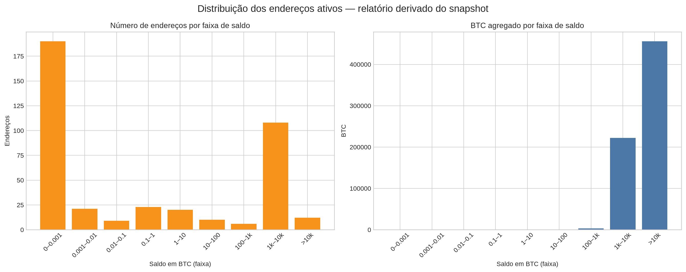
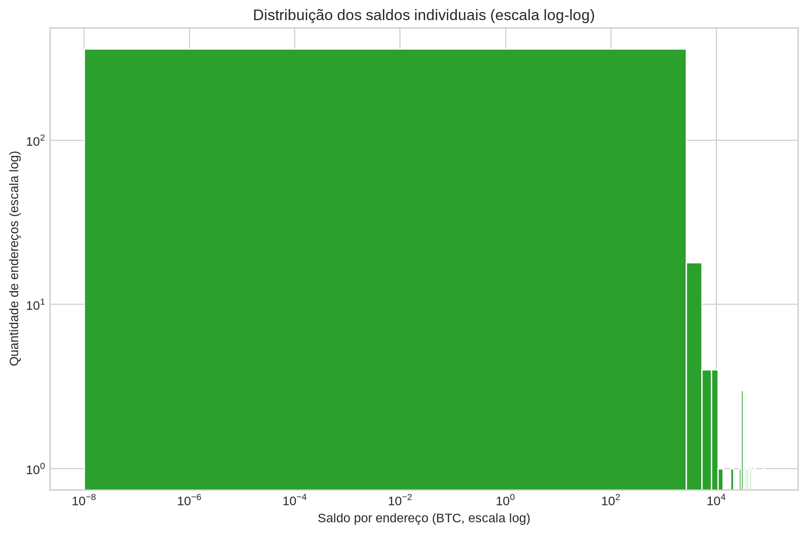

# Distribuição de saldos Bitcoin — snapshot

Este relatório visualiza o arquivo de evidência `active_wallets_report.csv` recuperado da branch `ben-master-wallet-update` do repositório `Nexus-HUB57/Master-MNS-BCK7`. Ele contém **399 endereços** com saldo positivo no snapshot e soma **681,319.80126451 BTC**.

> Este é um relatório de dados fornecidos/recuperados, não uma prova independente de titularidade, controle de chaves, solvência ou disponibilidade para gasto. Saldos on-chain devem ser reconfirmados na altura de bloco e data da consulta.

| Métrica | Valor |
|---|---:|
| Endereços ativos no snapshot | 399 |
| Saldo total | 681,319.80126451 BTC |
| Mediana por endereço | 0.00141000 BTC |
| Menor saldo | 0.00000001 BTC |
| Maior saldo | 79,957.26868453 BTC |
| Participação dos 10 maiores | 62.4766% |

## Visualizações

## Artefatos

`active_addresses_balances.csv` contém os endereços e saldos do snapshot; `distribution_summary.csv` contém a agregação por faixa; `statistics.json` contém métricas reproduzíveis; e os arquivos PNG são os gráficos.

Nenhuma chave privada, seed, arquivo de carteira, credencial ou segredo foi copiado para este pacote. Os dados sensíveis devem permanecer em armazenamento offline seguro e não devem ser versionados.
